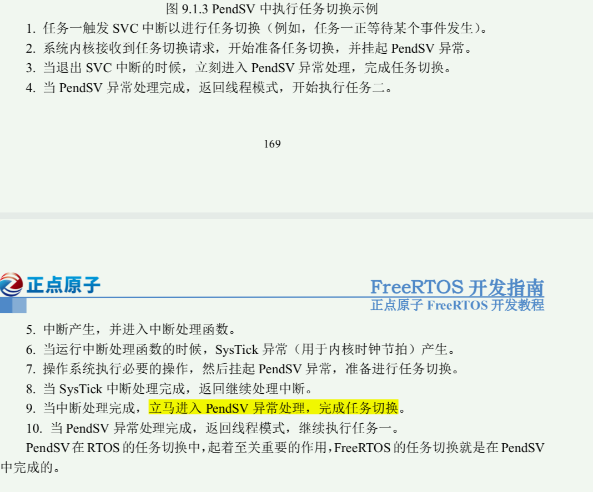

# 学习的知识点

1，荔枝的骚年嘛你是？你是荔枝要干嵌入式的嘛？

## FreeRTOS

1，
PendSV，SysTick，SVC三者的优先级：

- PendSV是异常，不是中断；
- SVC系统服务调用也是一种异常（特殊的）；
  - 是通过软件指令触发特权级系统调用，是用户态到内核态的桥梁；
  - 在单片机的语境中，SVC不是单只一个特定的服务，而是一类系统服务调用机制，以下面的代码举例：

  ```c
  __asm void prvStartFirstTask( void )
  {
  /* *INDENT-OFF* */
      PRESERVE8
      /* Use the NVIC offset register to locate the stack. */
      ldr r0, =0xE000ED08
      ldr r0, [ r0 ]
      ldr r0, [ r0 ]
      ...   // 省略代码
      /* Call SVC to start the first task. */
      svc 0
      ...  // 省略代码
  /* *INDENT-ON* */
  }

  例如：
  SVC 0x01：创建任务
  SVC 0x02：获取系统时间
  SVC 0x03：申请内存
  ```

  - 通过触发SVC指令，应用程序可以从用户模式切换到特权模式，调用操作系统或内核提供的服务；
- PendSV在RTOS的任务切换中，起着至关重要的作用，FreeRTOS的任务切换就是在PendSV中完成的；
- ** 注意中断优先级和任务优先级这两个不是同一个东西啊!
  - 中断优先级数值越小，优先级越高；
  - 任务优先级数值越大，优先级越高；
- 在ARM里面，任何可以打断程序流程正常执行的，都可以叫做“异常”
- 程序正常执行在“线程模式”，比如RTOS的任务、裸机程序的主循环……，中断和异常是工作在“处理模式”的；
  - 线程和进程 && 用户模式和特权模式：
    - 二者是计算机体系中并行的设计：线程和进程决定了计算机的资源如何分配和管理；后面的模式决定了程序的访问权限；
    - 进程：（独立内存空间）在嵌入式系统中很少使用，除非是资源丰富的系统（如 Linux 嵌入式）。
    - 线程：RTOS 中的任务 ≈ 线程，而非进程！
    - 为何嵌入式系统很少有进程？<https://www.doubao.com/thread/w5e090d87dd9ebf00>，每个进程的页表就吃掉大部分内存里！！！
