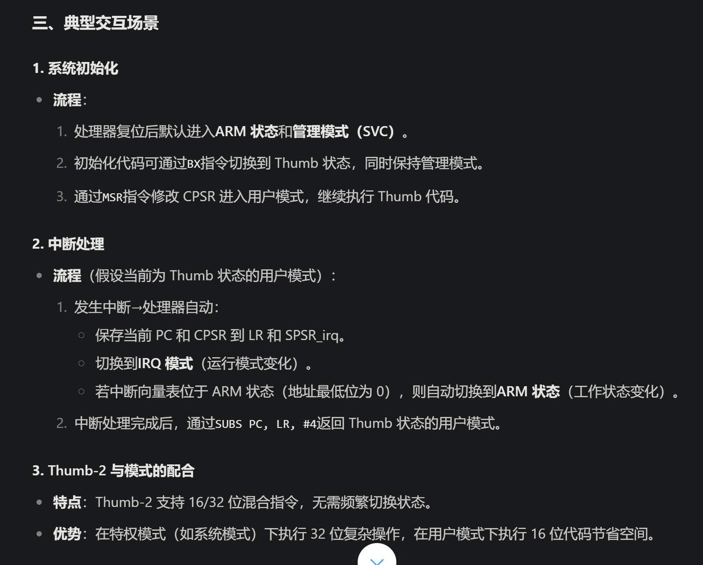
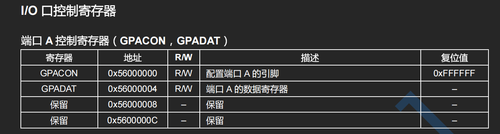

# FreeRTOS

1，PRIVILEGED_DATA修饰符的作用：限制遍历的访问，只能特权模式下访问，保障了系统的安全性；

2，直接使用“{}”的作用：[创建了一个作用域]，从而限制变量的作用域；

3，为什么在FreeRTOS的SysTick中断处理函数里面，要屏蔽所有受OS管理的中断？

- [最小化中断处理时间]SysTick中断执行时间影响着系统时钟的精度；保证SysTick中断处理函数的运行可以保证系统时钟的精度，完成后立即更新系统时间，避免计时误差；
- [防止调度器状态不一致]SysTick中断会通过 PendSV 中断实现上下文切换、检查是否有任务等待时间到期、决定是否需要切换到更高优先级的任务，如果被打断会导致额任务调度器混乱
- [防止栈溢出]避免中断多次嵌套，导致栈溢出；

4，FreeRTOS任务间的调用链；必须得耦合，闭环；

## Lx直播

1，嵌入式就三件事：

- 业务逻辑
- 代码架构
- 底层驱动

## ARM架构

1，ARM处理器工作状态和工作模式的关联：

- ARM处理器的两种工作状态：ARM和Thumb <https://www.doubao.com/thread/w62321f436b4a6c2f>
- ARM处理器的工作状态和ARM处理器的运行模式（工作模式）有关联吗？<https://www.doubao.com/thread/wdf3b57a61d16eac0>
- ARM→Thumb 切换：不改变当前运行模式（如用户模式仍为用户模式）
- 执行[BX]指令可以切换，但还是得看[目标地址值的最低位]；
- 处理器复位后默认进入ARM 状态和管理模式（SVC）
- 总结：<https://www.doubao.com/thread/w9cb2a977b6bed931>

2，ARM架构中，程序计数器寄存器PC的值如何计算： <https://www.doubao.com/thread/w66ba97bb94e3637c>

- 首先，记住PC永远指向下一步要“取指”的指令的地址！
- 取指 → 译码 → 执行 → 访存 → 写回 (5)
- 取指 → 译码 → 执行 (3)

3，PC和LR值的更新？手动？自动？

- PC：完全由硬件控制；
- LR：可能吧；
- <https://www.doubao.com/thread/w3bf1168401881fa3>

4，Review寄存器地址的本质：以三星S3C2440为例，GPIOA的控制寄存器：

- 配置寄存器的本质，是在对 对应地址上的数据进行操作，类比就是指针的解引用；
- 寄存器地址的本质，物理内存的映射，CPU 访问这些地址时，实际是在操作硬件寄存器的电路（而非普通内存）；
- <https://www.doubao.com/thread/wea35630038f22a4a>

5，ARM的四级存储结构：

- 寄存器、高速缓存、主存储器（内）、辅助存储器（外）
