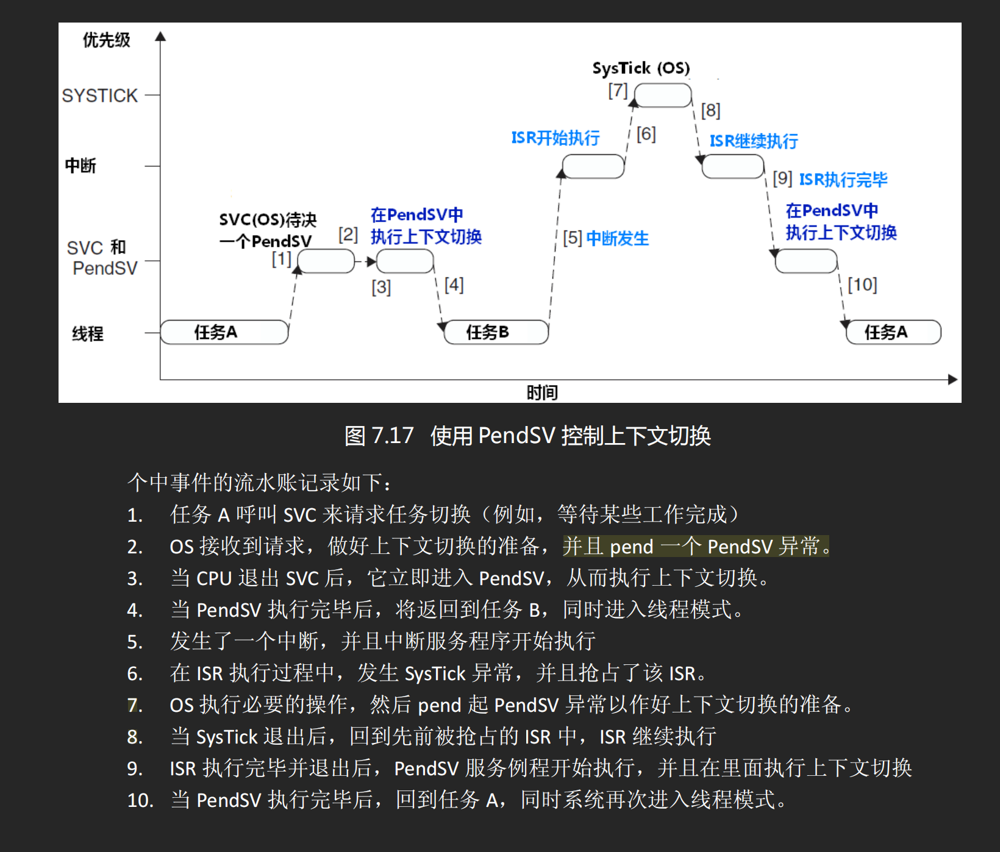

# FreeRTOS

1，源码的 task.c 和 port.c文件

- tack.c是[软件抽象层]，负责实现任务调度的逻辑框架和通用接口
  - 任务控制块（TCB） 的管理（创建、删除、挂起、恢复等）
  - 任务调度算法 的实现（如时间片轮转、优先级抢占）
  - 系统时钟节拍（tick） 的处理
  - 空闲任务 和 定时器服务任务 的创建
  - 与架构无关 的核心调度逻辑
- port.c是[硬件抽象层]，是针对特定硬件架构的移植层文件，负责实现与硬件密切相关的底层功能
  - 上下文切换 的底层实现（通过汇编或特定 CPU 指令）
  - 中断管理（如 PendSV、SysTick 中断配置）
  - 任务栈初始化（设置任务初始上下文）
  - 临界区保护（禁用 / 启用中断）
  - 架构特定 的优化和实现
- task提供的接口大多是调用了port提供的接口

2，源码xPortSysTickHandler

```c
void xPortSysTickHandler(void)
{
    // 提升中断优先级阈值，屏蔽比 configMAX_SYSCALL_INTERRUPT_PRIORITY 优先级低的中断
    // 由于 SysTick 是最低优先级中断，此时所有中断都是未屏蔽的，无需保存和恢复中断掩码
    vPortRaiseBASEPRI();
    {
        // 调用 xTaskIncrementTick 函数增加系统节拍计数器的值
        if( xTaskIncrementTick() != pdFALSE )
        {
            // 如果 xTaskIncrementTick 返回非 pdFALSE，说明需要进行任务上下文切换
            // 通过向 NVIC 中断控制寄存器写入 PendSV 置位位，触发 PendSV 中断
            portNVIC_INT_CTRL_REG = portNVIC_PENDSVSET_BIT;
        }
    }
    vPortClearBASEPRIFromISR();
}
```

## Cortex-M3

1，前导零是什么？作用是什么？

- 在嵌入式中，前导零CLZ，通常指的是有效数字前面的零，就比如“005，0x003等”，这样不影响数据的值，但是会改变数据的长度
- 前导零的作用多用在 使得输出的信息数据对齐，这样可以便于显示

2，中断向量化是什么？这样做的好处是啥？这是嵌入式OS和微处理器的核心机制

- <https://www.doubao.com/thread/w751a7771885a9387>
- [核心思想是给每个中断源分配固定的内存地址]；发生中断时，通过硬件自动识别并跳入中断源的对应的ISR入口，省去了查询的步骤
- 确保了快速性、准确性、高效性
- 从硬件上简化设计，所以硬件层面上无法更改的，只能通过软件上重映射下向量表
- 向量表本质上一个数组，数组元素时WORD，32位的数据

3，什么是fault和hardfault？

- fault是处理器执行中出现的“[可被处理的]异常错误”
- hardfault是fault的升级形态，当普通fault无法处理时、或处理过程有产生新的fault，就会hardfault，属于比较严重的

4，理解 PendSV+SysTick 控制上下文切换 

- 可以有任务自己呼叫SVC来切换任务（例如，等待某些工作完成），OS收到请求会pend一个OendSV的异常，当CPU退出SVC时会立马进入PendSV进行切换
- 如果在中断ISR执行时产生了SysTick异常，会立马进入SysTick的ISR执行必要操作，然后pend一个PendSV，SysTick执行完后继续当前的ISR，等所有比 PendSV 优先级高的中断 / 异常都处理完后，进入...
- 所有SysTick的ISR不可以太长太复杂
