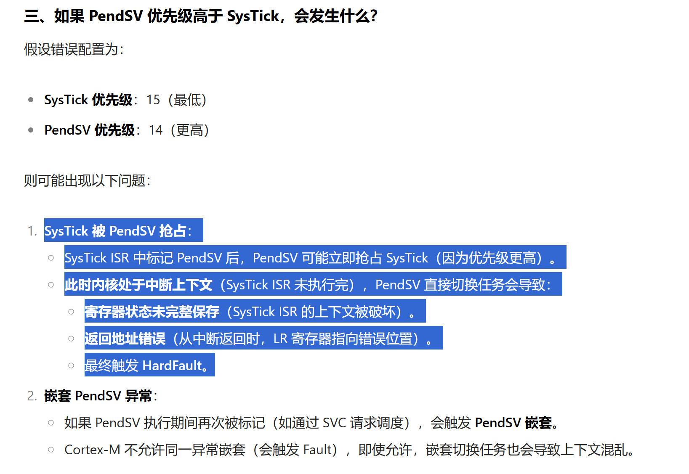

# FreeRTOS

1，深入理解FreeRTOS中的任务切换：

- <https://www.doubao.com/thread/w21d2c4b7b399ea05>
- PendSV是任务切换的核心，详情见xPortPendSVHandler源码
- PendSV使用汇编编写，实现汇编优化，执行时间非常短，仅24行，仅需要保存 / 恢复寄存器，相比SysTick的1ms，被SysTick打断的概率几乎不可能
- PendSV的优先级时最低的，SysTick次低，所以PendSV的执行一定是等SysTick执行完才去执行！
- 如果PendSV优先级高于SysTick，[因为上下文没有完整保存]触发hardfault 

2，PendSV的触发机制

- 核心机制：[软件标记&&硬件响应]
  - 先通过写 SCB->ICSR 寄存器的 PENDSVSET 位，软件标记 PendSV 异常待处理
  - 当 CPU 处于最低优先级上下文（无活跃中断），硬件自动触发 PendSV 异常服务函数
- SysTick是最常见的触发源，但不限于SysTick
- 任务自己主动通过SVC请求调度
- 某些外设中断服务函数主动通过SVC请求调度

## Cortex-M3

1，Cortex-M不允许同一异常嵌套，会触发fault

## MISC

1，判断a的值是否改变？还是编译报错？

```c
int main(void)
{
    int x = 3;
    int y = 4;
    const int a = x + y;
    printf("a=%d\n", a); 
    printf("x=%d\n", x); 
    printf("y=%d\n", y); 

    ++ x;
    ++ y;
    printf("a=%d\n", a);
    printf("x=%d\n", x); 
    printf("y=%d\n", y); 
}
输出：
PS D:\code\test\lanqiaosuanfa> .\a.exe     
a=7
x=3
y=4
a=7
x=4
y=5
```
