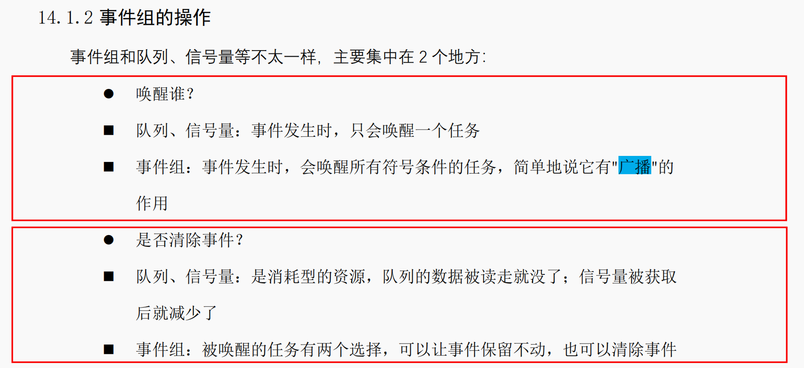
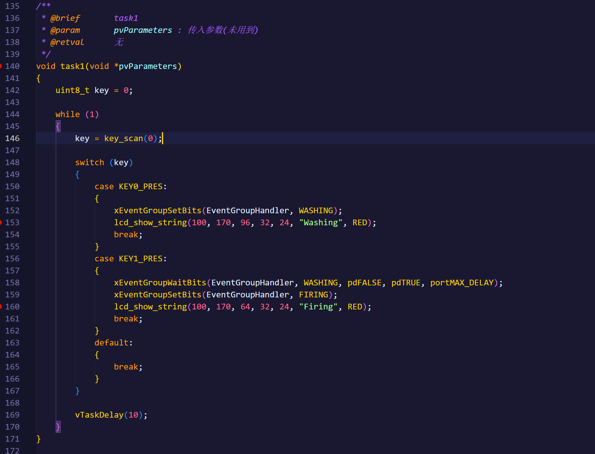

# FreeRTOS

1，FreeRTOS事件标志组

- 事件组的概念：
  - 事件组可以简单的看作就是一个整数
  - 是一个无符号、16位或32位的整数
  - 注意高8位是留给内核使用的
  - 事件组可以很好的处理多任务之间的同步关系
- 事件组的操作：
  - 事件组与信号量与队列的主要差异：
  - 创建、删除、等待、设置、清除（条件）、获取、同步
  - 等待事件组 中的 事件，可以理解为 “与” “或” 的关系
  - 设置事件组时，有可能导致多个任务被唤醒，这会带来很大的不确定性。
    所以xEventGroupSetBitsFromISR函数不是直接去设置事件组，而是给一个FreeRTOS后台任(daemontask)发送队列数据，由这个任务来设置事件组。

2，在 FreeRTOS 中，将xTicksToWait参数设置为portMAX_DELAY的确表示任务会一直等待，直到请求的操作成功或资源可用

3，FreeRTOS的任务通知

- IPC（Inter-Process Communication）指的是 “任务间通信机制”
- 所谓的“任务通知” 可以反过来读：“通知任务”
  - 与队列、事件组、信号量的区别
- 任务通知的优点：
  - 更省内存：相比队列、信号量、事件组这些传统IPC需要通过 创建函数额外创建独立的结构体，任务通知直接复用TCB中已有的字段即可
  - 效率更高：无需额外创建结构体，自然效率更快
- 任务通知的缺点：
  - 数据只能给该任务独享：使用队列、信号量、事件组时，数据保存在这些结构体中，其他任务、ISR 都可以访问这些数据。
    使用任务通知时，数据存放入目标任务中，只有它可以访问这些数据
  - 不能发送数据到ISR，只能ISR发送数据到任务，因为ISR没有任务结构体
  - 不能缓冲数据使用队列时，假设队列深度为 N，那么它可以保持 N 个数据。使用任务通知时，任务结构体中只有一个任务通知值，只能保持一个数据。
  - 如果发送受阻，发送方无法进入阻塞状态等待

## MISC

1，事件组同步出现卡死的情况：
？？？

2，pdMS_TO_TICKS，将对应的毫秒转换为RTOS的节拍数
3，理解RTOS中参数pxHigherPriorityTaskWoken：<https://www.doubao.com/thread/w23cc372ca09384c5>

- 在下列函数均有体现，出现在ISR版本中：

```c
BaseType_t xQueueGenericSendFromISR( QueueHandle_t xQueue,
                                     const void * const pvItemToQueue,
                                     BaseType_t * const pxHigherPriorityTaskWoken,
                                     const BaseType_t xCopyPosition )

#define xQueueSendFromISR( xQueue, pvItemToQueue, pxHigherPriorityTaskWoken ) \
    xQueueGenericSendFromISR( ( xQueue ), ( pvItemToQueue ), ( pxHigherPriorityTaskWoken ), queueSEND_TO_BACK )
  
中断ISR和任务调度的中间人
```
