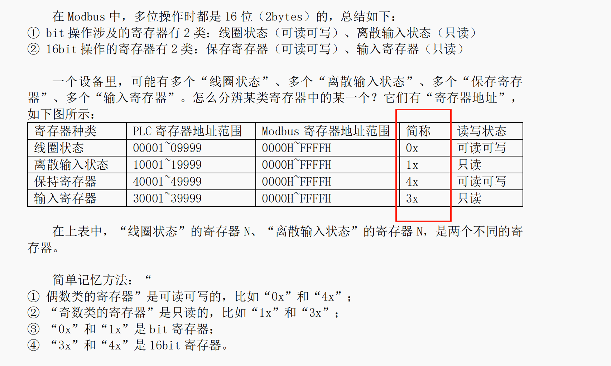
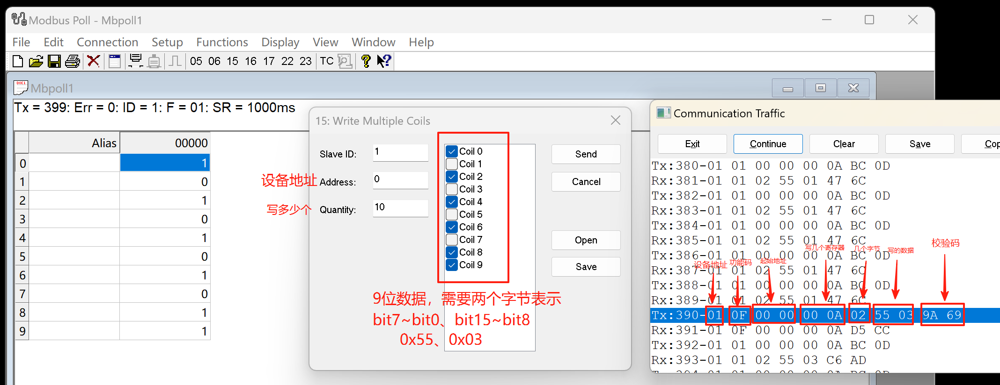
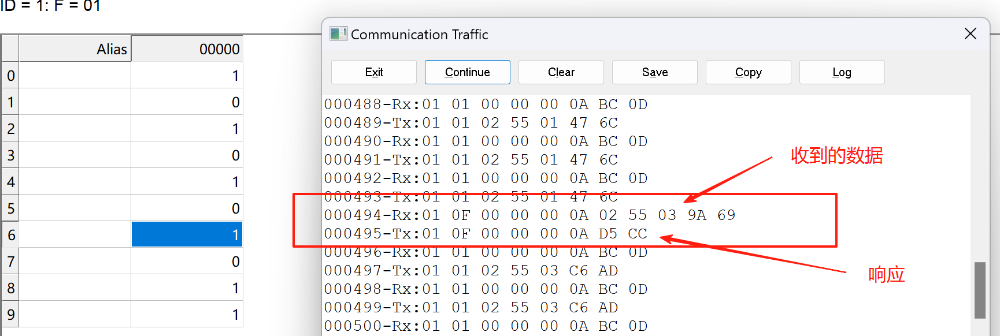
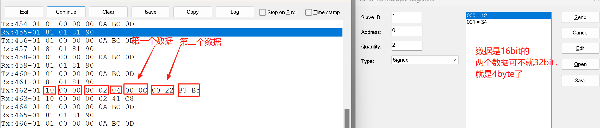

# Modbus

1，Modbus抽象出四种操作         寄存器类别                                     PLC类比理解

- `单bit`的只读操作             离散输入状态          理解为PLC里面的`I变量 输入继电器`   如 I0.0（外部数字量输入，状态由外部决定）
- `单bit`的可读可写操作          线圈状态             理解为PLC里面的`Q变量 输出继电器`   如 Q0.0（控制外部设备，可主动置1/置0）
- `16bit`的只读操作             输入寄存器            理解为PLC里面的`模拟量输入`        如 PIW256（外部模拟量输入值，只读）
- `16bit`的可读可写操作         保持寄存器            理解为PLC里面的`数据块字变量`或者`M变量`  如 DB1.DBW0（可读写，掉电保持）

2，Modbus寄存器的地址

- 
- 去访问一个寄存器时，先确定类，再确定是哪一个

## Modbus协议

3，Modbus协议学习的的"三大件"工具里面，为什么主机使用的软件名字是`Modbus Poll`？为什么不是`Modbus Host`？

- 核心原因是名字更直观地体现了主机在Modbus协议中的核心行为 ——`轮询（Poll）`，而`Host（主机）`只是角色定义，无法体现功能特性
- Modbus 协议的通信逻辑是`主机主动发起请求，从机被动响应`：
  - 主机需要不断向从机发送查询指令（比如 “读取某个寄存器的数据”），这种 “主动查询、循环获取数据” 的行为在通信领域被称为 “轮询（Polling）”
  - 这是Modbus主机最核心、最频繁的操作
- <https://www.doubao.com/thread/w80bdd05d325a6030>

4，Modbus是一主多从的协议

- Modbus是应用层的协议，通常来讲只有两根数据线`TxD`和`RxD`
- 主机Poll主动发起请求：
  - 
- TxD发送的数据：`设备地址`+`功能码`+`数据`+`CRC校验码`，
  - 设备地址来确定在众多设备中，要访问的设备
  - 功能码就是确定是 读/写 哪一`类`寄存器，约定俗成的
  - 数据和功能码相关：例如功能码想要读取`离散输入寄存器`类，那么数据里面肯定包含有：具体是哪个寄存器？想读多少个？以及数据本身

- 主从结构就会有从设备的响应Response
  - 
  - 响应的数据报文结构和上述是一样的

- 再看看写保持状态寄存器的数据报文格式
  - 

## MISC

1，在移植USBX实现虚拟串口时，PC发送的数据不能正常地回显在LCD上，经过故障排查，发现是在写队列时，传入的参数错误

- 代码详情：

```c
int ux_device_cdc_acm_getchar(uint8_t *data, uint32_t timeout)
{
    if (pdPASS == xQueueReceive(g_xUSBUART_RX_Queue, &data, timeout))
}

这里的参数应该时 data，而不是 &data

```
