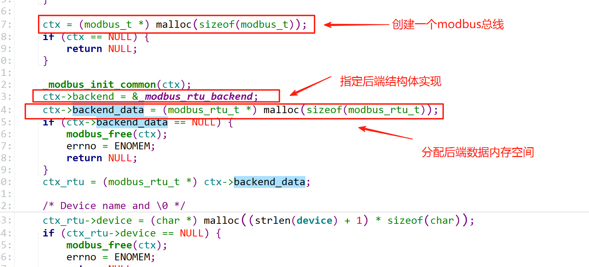

# libmodbus源码---发送请求分析

## 函数 modbus_new_rtu

1，函数原型

```c
modbus_t * modbus_new_rtu(const char *device, int baud, char parity, int data_bit, int stop_bit);
Omitted code...
 _modbus_init_common(ctx);
ctx->backend = &_modbus_rtu_backend;
ctx->backend_data = (modbus_rtu_t *) malloc(sizeof(modbus_rtu_t));
if (ctx->backend_data == NULL) {
    modbus_free(ctx);
    errno = ENOMEM;
    return NULL;
}
ctx_rtu = (modbus_rtu_t *) ctx->backend_data;
Omitted code...
```

- 
- 主要干了这些事：
- 分配了一个 modbus_t 结构体，用来表示一条 modbus 总线
- 设置后端`backend`，
- 分配后端相关的数据`backend_data`
  - 里面会用来保存串口的一些属性
- 设置后端相关的数据（源码往下翻）

## 函数 modbus_set_slave

1，函数原型

```c
int modbus_set_slave(modbus_t *ctx, int slave)
{
    if (ctx == NULL) {
        errno = EINVAL;
        return -1;
    }

    return ctx->backend->set_slave(ctx, slave);
}
```

- 前面函数 modbus_new_rtu 设置（指定）了后端`ctx->backend = &_modbus_rtu_backend;`
  - 所以后面分析的时候就去看`_modbus_rtu_backend`结构体的内容
- 设置`client`要访问的从设备

- 函数 modbus_set_slave 设置slave的时，调用了bankend的`set_slave`函数
  - `ctx->backend->set_slave(ctx, slave);`
  - 最后落到设置modbus_t结构体的slave

## 函数 modbus_connect

1，函数原型

```c
int modbus_connect(modbus_t *ctx)
{
    if (ctx == NULL) {
        errno = EINVAL;
        return -1;
    }

    return ctx->backend->connect(ctx);
}
```

- 与硬件相关
- 打开串口，设置参数

## 函数 modbus_write_bits

1，函数原型

```c
int modbus_write_bits(modbus_t *ctx, int addr, int nb, const uint8_t *src)
{
    Omitted code...
    req_length = ctx->backend->build_request_basis(ctx, MODBUS_FC_WRITE_MULTIPLE_COILS, addr, nb, req);
    ...
}
```

- 函数`ctx->backend->build_request_basis`是在`_modbus_rtu_backend`中调用
  - 看函数的参数，是和之前分析的Modbus数据报文格式一致的,但是这里只是`构造基础请求包`
  - 只含有slave id、function code、、、，至于写多少？校验那些则是用户决定
