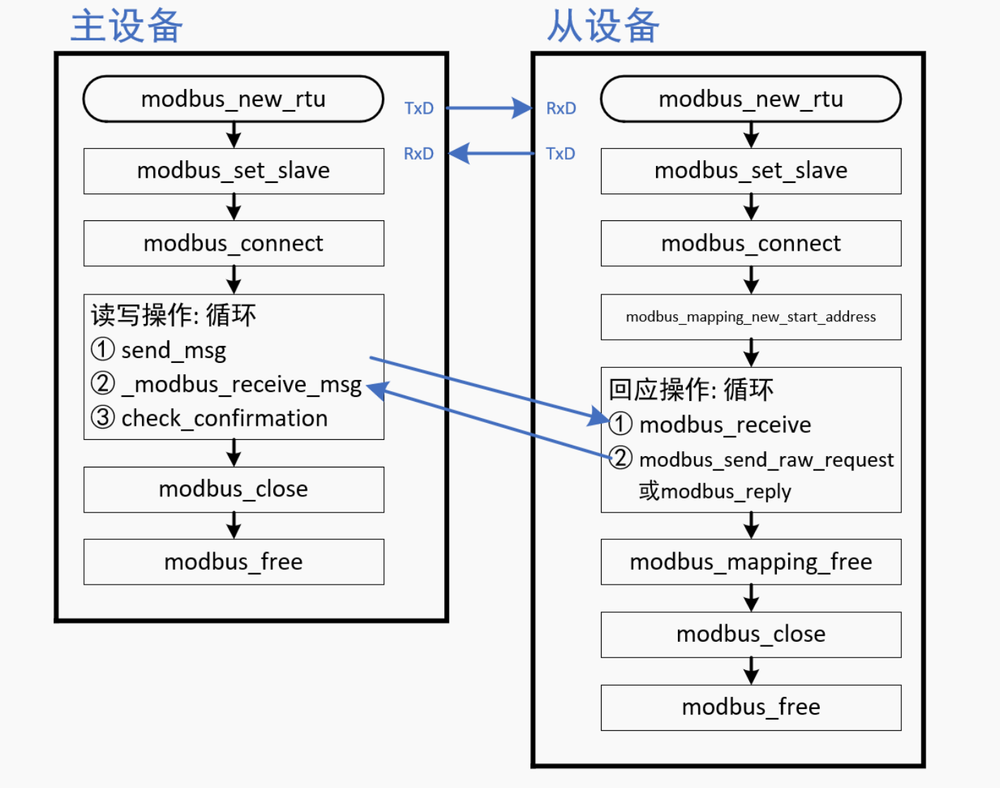

# libmodbus源码---接收请求分析

1，libmodbus核心函数调用过程

- 

2，接收函数最终的实现都是在`modbus.c`文件中的函数`_modbus_receive_msg`实现

- 主机和从机本质上使用的接收函数是同一个
- 函数定义：

```c
int _modbus_receive_msg(modbus_t *ctx, uint8_t *msg, msg_type_t msg_type)
```

- 其中参数`msg_type_t msg_type`是用来区分：主机的发送 ？ 从机的回应
  - 取值可以是`MSG_INDICATION` 或 `MSG_CONFIRMATION`
  - 上述的英译分别是：“指示，标示”  “确认，确定”

- 在Linux下还会使用一个`select`函数判断有没有数据

```c
rc = ctx->backend->select(ctx, &rset, p_tv, length_to_read);
if (rc == -1) {                                                 // 超时了
    _error_print(ctx, "select");
Omitted code...

rc = ctx->backend->recv(ctx, msg + msg_length, length_to_read); // 读取数据，这里是原始数据
if (rc == 0) {
    errno = ECONNRESET;
    rc = -1;
}

参数p_tv：超时时间
struct timeval tv;
tv.tv_sec = ctx->indication_timeout.tv_sec;
tv.tv_usec = ctx->indication_timeout.tv_usec;
p_tv = &tv;
// Or
tv.tv_sec = ctx->response_timeout.tv_sec;
tv.tv_usec = ctx->response_timeout.tv_usec;
p_tv = &tv;
// 接收后续数据时，只愿意等待一个字节的时间
tv.tv_sec = ctx->byte_timeout.tv_sec;
tv.tv_usec = ctx->byte_timeout.tv_usec;
p_tv = &tv;
```

- 读取步骤大致如下
  - 确认要读取的数据长度`length_to_read`
  - 等待数据
  - 读取原始数据
  - 分阶段读取数据
  - 检查数据完整性

- 要读多少字节数在函数里面也是可以找到对应的定义的，每个步骤step也是不一样的，如下的枚举：

```c
/* 3 steps are used to parse the query */
typedef enum {
    _STEP_FUNCTION,
    _STEP_META,
    _STEP_DATA
} _step_t;              // 使用了 3 个步骤来解析查询内容

在 _modbus_receive_msg 源码可以清晰的看到上面三个步骤的标识
蕴含着 状态机编程 的思想，下一步step会根据前一个step的状态来选择要进行的操作
```

## libmodbus源码---从机回应

1，在modbus中有多种寄存器，每个寄存器的个数可以有一个或多个，那我们该如何区分和定义它们呢？

- 在创建一个`modbus`设备的时候，我们可以去分配这些寄存器的内存

```c
modbus_mapping_t *mb_mapping;
// 分配内存，不同的寄存器都有分配到，但总归就四类寄存器
mb_mapping = modbus_mapping_new_start_address(UT_BITS_ADDRESS,
                                                UT_BITS_NB,
                                                UT_INPUT_BITS_ADDRESS,
                                                UT_INPUT_BITS_NB,
                                                UT_REGISTERS_ADDRESS,
                                                UT_REGISTERS_NB_MAX,
                                                UT_INPUT_REGISTERS_ADDRESS,
                                                UT_INPUT_REGISTERS_NB);
// 结构体原型
typedef struct _modbus_mapping_t {
    int nb_bits;        // 离散输入状态寄存器（只读）类寄存器的个数，几个？
    int start_bits;     // 该类寄存器的要读的起始地址
    int nb_input_bits;
    int start_input_bits;
    int nb_input_registers;
    int start_input_registers;
    int nb_registers;
    int start_registers;
    uint8_t *tab_bits;      // 一个byte对应位寄存器的一个bit；这里是数据，数组的大小由前面的 @param int nb_bits;决定
    uint8_t *tab_input_bits;
    uint16_t *tab_input_registers;  // 这里就是每两个byte对应多位（16）寄存器的16bit，
    uint16_t *tab_registers;
} modbus_mapping_t;                // 带有输入input字样的表示只读
```

- 那问题来了，我们该如何去使用这些分配好的数组呢？
  - 当从机server收到client发来的数据请求后，只需要调用函数`modbus_reply`

  ```c
  int modbus_reply(modbus_t *ctx, const uint8_t *req, int req_length, modbus_mapping_t *mb_mapping);

  解析主机发来的请求：要么读，要么写 modbus_mapping_t 里面的数组（来写/读这些寄存器）
  发出回应，写完了...
  这样看，该函数并不涉及硬件上的操作
  ```

## 详细的还是看韦东山老师的视频吧

- 看视频，♥四四的了...
