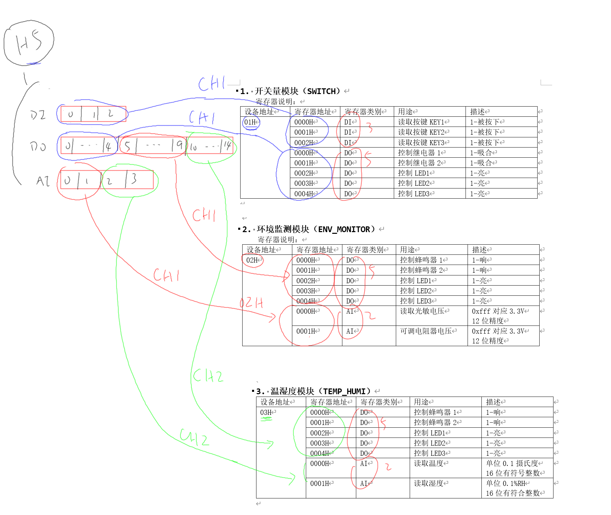
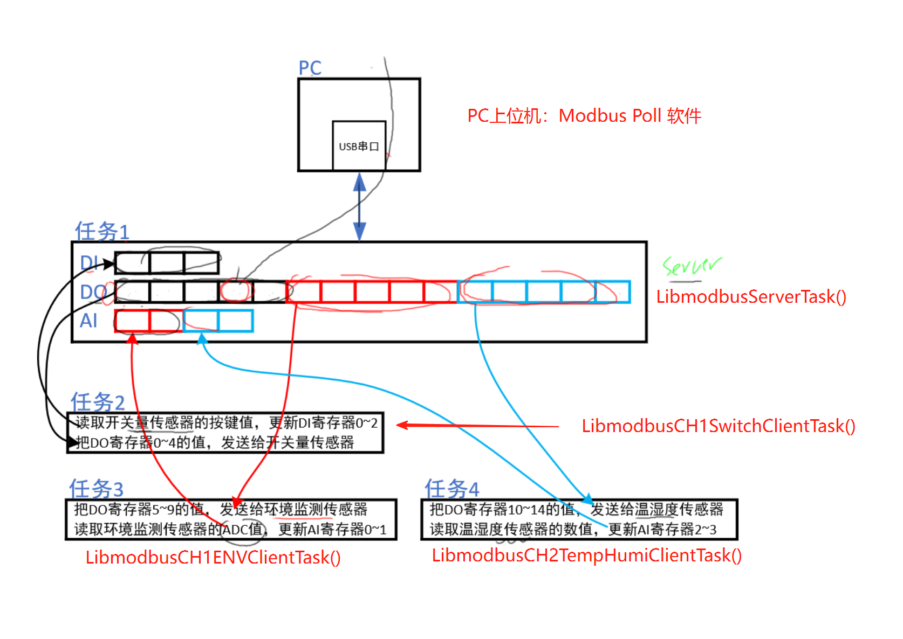
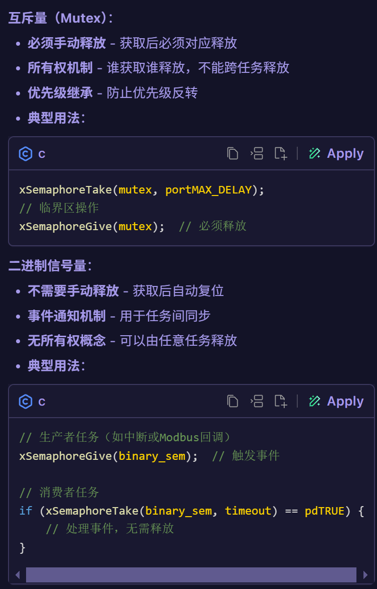

# STM32H5作为Server

1，PC端要访问到我们的`Modbus`传感器：

- 实际上访问`stm32h5`的内存buf
- 这就需要在`PC`上访问的寄存器`映射`到实际的`Modbus传感器`上
- 所以stm32h5上需要有一个`映射表`
- 对于实际的产品，这个映射表是可以根据实际要求动态设置的

2，先来看看如何制作一个固定的映射表：

- 
- 首先要知道硬件上 4类modbus寄存器的个数情况，统计
- stm32h5再通过`usb-serial`和PC端交互

- 创建“这些”寄存器：创建一个`mb_mapping`

```c
modbus_mapping_t *mb_mapping;

mb_mapping = modbus_mapping_new_start_address(0,          // 起始地址都设为 0
                                              15,         // DO 个数
                                              0,
                                              3,          // DI 个数
                                              0,
                                              0,
                                              0,
                                              4);         // AI 个数
g_mb_mapping = mb_mapping;      // 全局Modbus寄存器映射结构体指针，用于统一管理所有Modbus寄存器数据

- 上述的寄存器都是在 Slave ID == 1 的设备里，再通过映射，到真实的传感器设备中去
- 在PC上位机中修改（写）寄存器时，比如修改 “Slave ID = 1， Addr = 6”的寄存器，你就得知道：这实际上对应着 “Slave ID = 1，Addr = 5”的寄存器（举例）
- 看下面的代码示例：


/* 根据 PC的数据唤醒传感器模块, 即唤醒对应的任务 */
if (memcmp(&do_registers_backup[1], &mb_mapping->tab_bits[1], 5) != 0) // 唤醒 task1，如果上位机修改了 开关量传感器DO寄存器的任意一个值
   xSemaphoreGive(g_BinarySemaphoreSwitch);
if (memcmp(&do_registers_backup[6], &mb_mapping->tab_bits[6], 5) != 0) // 唤醒 task2
   xSemaphoreGive(g_BinarySemaphoreENV);
if (memcmp(&do_registers_backup[11], &mb_mapping->tab_bits[11], 5) != 0) // 唤醒 task3
   xSemaphoreGive(g_BinarySemaphoreTempHumi);

memcpy(do_registers_backup, mb_mapping->tab_bits, 16);      // 保存 DO寄存器的值

```

3，资源使用的保护：互斥操作

- 在这次的实验操作中，需要多次使用到绘制LCD函数，为了避免多个任务之间冲突，引入互斥量`Mutex`
- 下面是代码示例：

```c
#define MULTI_DEVs_ACCESS   1

void Draw_Init(void)
{
#ifdef MULTI_DEVs_ACCESS
    /* 创建 Mutex */
    g_spi_lcd_lock = xSemaphoreCreateMutex();
#endif

    LCD_GetInfo(&g_lcd_width, &g_lcd_height);
}

static void Draw_Region(uint32_t x, uint32_t y, P_BitMap ptBitMap)
{
#ifdef MULTI_DEVs_ACCESS
    /* 多设备访问的保护机制：获取 Mutex */
    xSemaphoreTake(g_spi_lcd_lock, portMAX_DELAY);
    LCD_SetWindows(x, y, x + ptBitMap->width - 1, y + ptBitMap->height - 1);
    LCD_SetDataLine();
    LCD_WriteDatas(ptBitMap->datas, ptBitMap->height * ptBitMap->width * 2);
    /* 多设备访问的保护机制：释放 Mutex */
    xSemaphoreGive(g_spi_lcd_lock);
#endif
    /* 设置要显示的区域 */
    LCD_SetWindows(x, y, x + ptBitMap->width - 1, y + ptBitMap->height - 1);

    /* 设置D/C引脚表示后面要发送数据 */
    LCD_SetDataLine();
    
    /* 发送数据 */
    LCD_WriteDatas(ptBitMap->datas, ptBitMap->height * ptBitMap->width * 2);
}

- 注意获取`Mutex`要放在函数的最开始，这样去避免访问冲突
```

4，使用二值信号量去唤醒任务：

- 
- 在这次的实验操作中：
  - LibmodbusServerTask任务负责接收PC发来的请求，并选择的唤醒对应的任务：通过释放对应任务需要的信号量
  - 每个任务在自己的任务函数中，通过获取信号量的方式，来判断是否需要执行任务
  - 每个任务相对于实际的Modbus传感器，同时也是一个`Modbus-Client`
  - 每个任务就会去`modbus_set_slave(...)`实际的传感器地址，读取对应的、需要的数据

## 碰到的问题

1，任务的栈空间不够

- FreeRTOS的堆和任务栈<https://www.doubao.com/thread/w9a6e6aeb252a60c4>
- 如何调试栈空间不够的bug？
- 这类bug有哪些特点？
2，依然是，，，，传入的参数错误，

```c
memset(mb_mapping->tab_registers, 0, mb_mapping->nb_registers * 2); // 要乘以 2

mb_mapping->tab_registers 写成了 &mb_mapping->nb_registers
```

## 补充

1，二进制信号量：在被获取后会自动复位，不需要手动释放，           互斥量（Mutex）：必须手动释放 - 获取后必须对应释放

- 

## 点表映射操作传感器的原理、总结向

- PC端访问的，实际上只是H5的寄存器，master的
- 从 `Red_addr_master` 到 `Reg_addr_slave`，这中间必定会有一个映射关系，即映射表
- 映射表中包含的参数；
  - 中控的寄存器（或者说，中控这个`大寄存器`）
  - 使用中控的哪一个通道？
  - 传感器的设备地址
  - 对应设备地址下的寄存器
  - 该寄存器的类型，DO？DI？AI？AO？
- 使用结构体来表示一个点的映射关系

```c
typedef struct PointMap {
    char reg_type[5];      // 寄存器类型
    uint16_t reg_addr_master;// 主控的寄存器地址
    uint16_t channel;       // 通道号 0-主控本身  1-通过CH1访问  2-通过CH2访问
    uint16_t device_addr;   // 传感器的设备地址
    uint16_t reg_addr_slave; // 传感器的寄存器地址
} PointMap, *pPointMap;
```

- 用户在上位机界面添加点的时候，后台程序就会创建这些映射表（后续QT开发的上位机）

## 上位机如何发送这些点的映射关系？

- 使用基于modbus_write_file_record实现的modbus_write_file功能
- 当`file_no`是0时，表示发送的数据是点的结构体，即点的映射关系
- 根据`write_file_record`的定义，msg[10]开始，每个数据都是上述PointMap结构体的内容（PC发送的）
- 中控会见这些结构体memcpy到一个结构体数组里面

## 中控如何处理这些点的映射关系？

- 上位机主要就两个功能：
  - 用户点击之后生成点的映射关系（lvgl代码部分）
  - 发送点的映射关系到中控（上位机的眼里只有中控）
- 在中控程序中：
  - 存储点的映射关系
  - 分配对应的资源（DO、DI、AI、AO这几类寄存器）
  - 处理上位机的读写请求（只是操作DO、DI、AI、AO寄存器，不涉及后续的传感器）
- 那么，谁来把这些数值发给具体的模块（具体的传感器），又是谁从具体的传感器得到数值来更新这些寄存器呢？
  - 由 CH0_Task、CH1_Task、CH2_Task这几个任务来完成
  - 以CH2_Task为例分析：
    - CH_Task会遍历这些映射关系表
    - 找到结构体（关系表）中 channel = 2的点
    - 访问传感器
