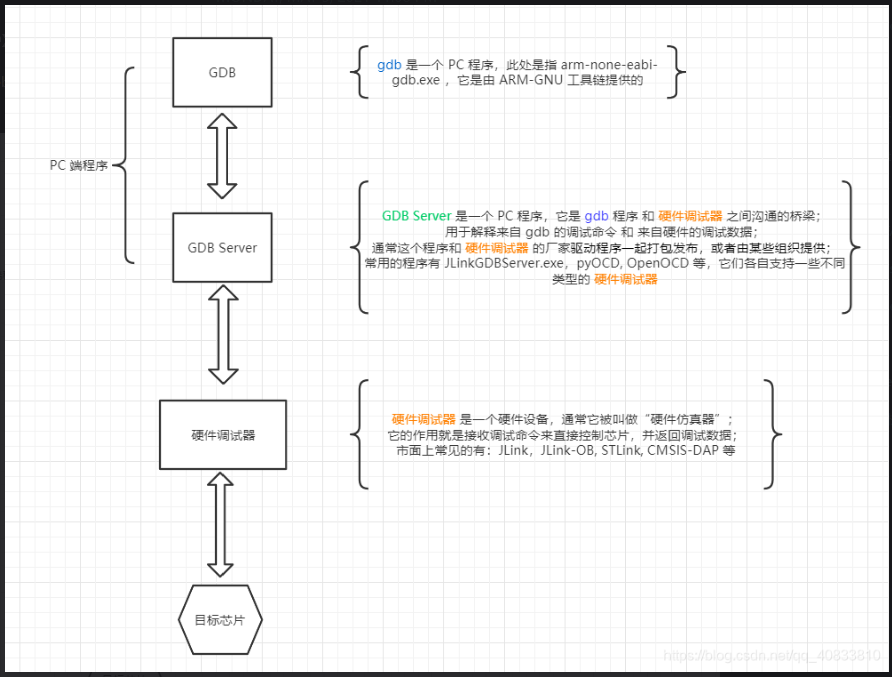

# RTOS调试

1，插件工具的准备（在Vscode中）

- Cortex Debugger （会自动安装依赖项，其中就包括RTOS View），相关配置参见：[text](<Vscode EIDE+Cortex Debug搭建STM32开发仿真环境.html>)
- EIDE，相关配置参见：[text](VSCode+EIDE开发STM32.html)

2，settings.json 文件：

- 注意不是 .vscode 文件夹下的settings.json，是在 Cortex Debugger 设置中：“在~中编辑”打开的settings.json
- 要添加的主要是：

```json
    "cortex-debug.armToolchainPath": "D:\\Program Files (x86)\\GNU Arm Embedded Toolchain\\10 2021.10\\bin",    // ARM Tool Chain 可以自行下载，也可以用eide下载
    // "cortex-debug.armToolchainPath": "C:\\Users\\33362\\.eide\\tools\\gcc_arm\\bin",                         // 这个eide下载的也是可以的
    "cortex-debug.openocdPath": "C:\\Users\\33362\\.eide\\tools\\openocd_7a1adfbec_mingw32\\bin\\openocd.exe",  // 用eide下载，默认存在C/User/.eide/...的位置

    - ARM Tool Chain是浏览器下载的
```

3，launch.json 文件：

- 主要添加的是：

```json
        {
            "cwd": "${workspaceRoot}",              // 路径，不用改动
            "type": "cortex-debug",                 // 仿真类型，不用改动
            "request": "launch",
            "name": "ST-Link",                      // ST-Link，这个随意，最后对应的名字选对就行
            "servertype": "openocd",                // GDB-Server：仿真服务类型
            "executable": "D:\\TEXT_EIDE\\Projects\\MDK-ARM\\build\\FreeRTOS\\atk_f407.elf",    //需要修改成你自己文件路径和名称，若搞不定路径使用绝对路径也可以
            "runToEntryPoint": "main",
            "configFiles": [
               "C:\\Users\\33362\\.eide\\tools\\openocd_7a1adfbec_mingw32\\share\\openocd\\scripts\\interface\\stlink-v2.cfg",  // 仿真器配置文件
               "C:\\Users\\33362\\.eide\\tools\\openocd_7a1adfbec_mingw32\\share\\openocd\\scripts\\target\\stm32f4x.cfg"       // 目标配置文件
            ]
        }
    - .elf 文件是 ELF（Executable and Linkable Format，可执行与可链接格式） 标准的文件，是嵌入式开发和 Linux 环境中核心的程序载体
    - 仿真器配置文件在：C:\Users\33362\.eide\tools\openocd_7a1adfbec_mingw32\share\openocd\scripts\interface
    - 目标配置文件在：C:\Users\33362\.eide\tools\openocd_7a1adfbec_mingw32\share\openocd\scripts\target
```

4，为何如此设置，为什么是仿真服务类型是OpenOCD？

- 
- gdb是一个PC程序，此处是指 arm-none-eabi-gdb.exe，由ARM-GNU提供
- GDB Server是一个PC程序，是 gdb程序 和 硬件调试器 之间沟通的桥梁，用于解释来自gdb的命令和硬件的调试数据
  - 常见的GDB Server程序有：OpenOCD，JLinkGDBServer.exe，pyOCD
- 硬件调试器是一个硬件设备，也叫“硬件仿真器”，作用是接收调试命令来直接控制芯片，并返回调试数据
  - 市面上常见的硬件调试器：JLink，STLink，CMSIS-DAP，JLink-OB
- <https://discuss.em-ide.com/blog/67-cortex-debug>：里面关于launch.json的属性介绍的很详细

5，GDB：GNU Debugger
