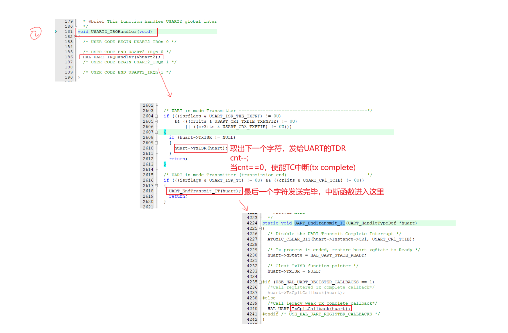

# 波特率是什么？

1，波特率BaudRate算时间：

- 115200波特率，表示传输一个bit需要 1/115200 s
- 在“ 1 + 8 + 1 ” 的经典配置下，可以算出，传输 1个Byte 需要的时间是 (1/115200)*10 （一个数据帧就传输一个字节数据嘛）
- 则可以计算得到，传输速率为 11520 Byte/s

2，高电平是基于 TTL 或者 CMOS 电平来考虑的

3，波特率：1秒内传输信号的状态数（波形数）      比特率：1秒内传输数据的bit数

- 如果一个波形，可以表示 N 个bit， 那么： 波特率 * N == 比特率

4，UART三种编程方式：查询、中断、DMA

- 数据传输涉及的三要素：源、目的、长度
- 其中DMA的效率最高

5，RS485电平：两线电压差为：+（2至6）V表示逻辑1， -（2至6）V表示逻辑0

- 是半双工的
- 电平转换芯片：MAX13487EESA
- 将TTL电平装欢成RS485电平
- TTL电平：3.3V 或 5V通常表示逻辑1，低电平接近 0V（通常≤0.8V）表示逻辑0

6，UART编程使用中断方式：

- 使用中断发送数据的流程...
- 当Tx完成或Rx完成会调用回调函数

```c
HAL_UART_Transmit_IT(&huart2, &c, 1);     // 开启中断，启动发送

只是记录这些数据的信息、提供一个回调函数、最后使能中断而已
huart->pTxBuffPtr  = pData;
huart->TxXferSize  = Size;
huart->TxXferCount = Size;
huart->TxISR       = NULL;

Rest some code ... 

else
{
    huart->TxISR = UART_TxISR_8BIT_FIFOEN;      // 发送完成后，会调用这个TxISR
}
/* Enable the Transmit Data Register Empty interrupt */
ATOMIC_SET_BIT(huart->Instance->CR1, USART_CR1_TXEIE_TXFNFIE);

后续都靠提供的ISR来实现（USARTx_IRQHandler）
void USART2_IRQHandler(void)
{
    Rest some code ... 
    HAL_UART_IRQHandler(&huart2);
    Rest some code ... 
}

```

- 
- 使用DMA来转发数据，也会在最后产生一个完成中断，最后还是会 调用 xxxRxCpltCallback()、xxxTxCpltCallback()

7，效率最高的UART编程方式：

- 要想保证读到的数据不丢失的话，我们需要在内存中开辟一个buf：我们需要将数据从硬件上读出来存在这个buf里面
  - 裸机：环形buffer
  - RTOS：队列queue
- 多任务系统里面一般不使用查询方式，对实时性影响大
- DMA（只会中断CPU一次、我们这里也配合使用FIFO） 和 中断（会中断N次CPU）的方式，都需要我们去执行到代码，才会开启数据传输，也不大好
- 所以我们引入空闲中断：Idle        （还能控制接收多少个字节吗？？？）
- 结合UART的数据帧，当检测到Tx发送空闲时，会产生一个空闲中断
- 等待完成：就是等待某些变量的值改变
- UART中断编程方式没有必要使用空闲中断，本来就是每接收一个数据（u8或u16类型）就会产生一次中断...

- 接收：完成 xxxCpltCallback(), xxxRxEventCallback()两个回调函数
  - 在一开始就开启 DMA+Idle中断
  - xxxCpltCallback()：read 和 save
  - xxxRxEventCallback()：重新开启 DMA+IDLE  接收
- 发送：重新开启DMA发送

8，注意上述的种种回调函数都是在中断的上下文中执行的，所以使用RTOS的函数要使用带ISR的版本
