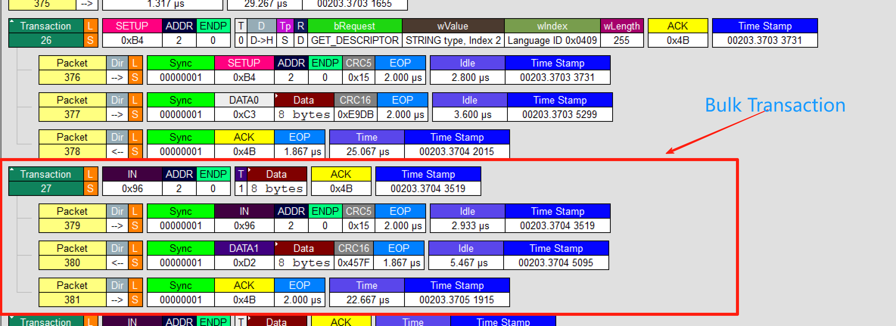
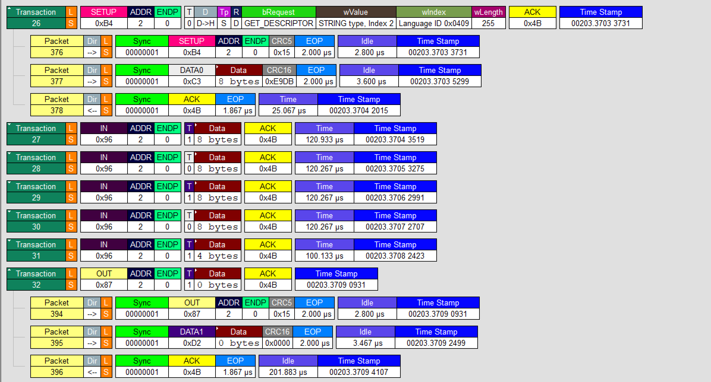
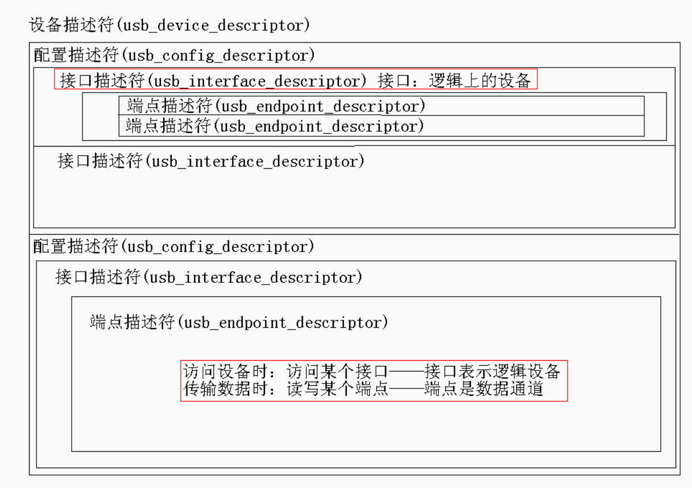

# USB设备编程

1，为什么要涉及USB设备？

- 快！
- 主从结构！

2，CPU必须通过 USB Host(Root Hub) 才可以访问 后面的设备 （其他的USB Func设备）

- 
- USB Host：它跟处理器相连，处理器通过USB Host 跟各类USB设备通信。
- USB Host 中集成有一个 root hub
- USB Device 分为两类：
  - Hub：用来扩展USB接口
  - Func：即普通的USB设备，比如U盘，声卡等

3，软件层面访问USB设备的过程：

- 
- 这里必定有USB Host的驱动程序
- 当你想访问某些设备的话，只有这些设备本身（只有编写这些设备驱动程序的人）才知道你要收发的数据是什么含义（比如 U 盘的存储驱动会解析 “读取文件” 指令，打印机驱动会解析 “打印页” 指令）
- 我们的 APP（应用程序）可以通过 某一个USB设备的驱动程序，来进行设备驱动生成具体指令（如 “读取扇区 0x123”）
  - 该USB设备驱动程序会与下面的USB Host驱动程序交互（Host 驱动将指令封装成 USB 总线协议的数据包（符合 USB 规范的电信号和格式）
    - 当然我们的APP也可以直接和USB Host驱动程序交互
    - 所以APP有两种访问硬件的途径，当然上述两种的目的也是不同的
  - 最终访问到 USB设备（Host 驱动生成的数据包发给设备）
  - 上述过程有点类似于：APP先告诉老大（Host），老大（Host）再传话（发命令）给你需要的人（other USB Device），老大拿到消息（Device回应）后再给APP
  - 核心链路（APP → Host → 设备 → 回传 → APP）
  - <https://www.doubao.com/thread/wa7bf7c27f2403e00>

4，USB Hub是怎么检测出有USB Device插进或者拔开了 && 设备速率的识别：

- USB Hub没有上拉电阻Rpu，USB Device没有下拉电阻Rpd
- 对于USB Hub：有两个下拉电阻，15k
- 对于USB Device：有一个上拉电阻：1.5k（可能接在Data+上，也可能Data-上）
  - D+（Data+）：全速 / 高速 设备
  - D-（Data-）：低速 设备
  - 对于Hub而言：通过检测D+、D-的电平变化，Hub可以知道插入的是 低/全速 设备的哪一种
    - 高速和全速可以兼容
    - 低速和高速不可兼容

  - 高速设备的插入检测：
    - Hub发出SE0信号（D+和D-都是低电平的复位信号），Device收到，如果Device支持高速，则发给Hub一个K信号
    - Hub收到K信号后，如果Hub自己也支持高速的话，则再发送一连串的 KJKJKJ...信号（序列）
    - Device收到序列后，确定双方都支持高速，就会在高速模式下工作，此时断开D+上的上拉电阻
    - 这是一个握手的过程...
  - 高速设备的拔出（断开）检测：
    - ......如果检测到信号强度突然很大......
    - 如果在调试一个高速设备时，设备老是自己断开的话，肯定是硬件的问题，电阻不匹配！

5，USB数据信号（对于LS、FS）

- 数据包的格式：
- SOP（Start of Packet）
  - 从Idle状态（J状态），变为K状态 的过程，注意是跳变的过程，不是跳变的结果，这就是一个开始传输的信号
  - 注意LS和FS的J、K状态下D+、D-的电平是不一样的
- SYNC（同步信号）
  - 就是J、K序列：3对KJ + 2个K
- Packet Content
  - PID：Packet`s ID，要传输的时什么包
    - PID Format：有16种Packet，可以分为4类
  - 地址：设备addr + endpoint
- CRC校验码
- EOP（End of Packet）

- 数据传输的 完整的 流程：事务（ 一般是 令牌包-数据包-握手包 组成的，最后的握手包是 Device->Host ）
  - 事务：由包Packet组成
  - 令牌包：也叫 token phase，令牌阶段
  - 数据包：也叫 data phase，数据阶段
  - 握手包：handshake phase，握手阶段 （最短的，没有Data和CRC的）

- 包的组成叫做域field：SOP域、SYNC域、PID域、Data域、CRC域、EOP域......
- 域由一位一位的bit数据组成

6，NRZI和位填充

- 
- Non Return Zero Inverted Code：变化时该是0就是0，该是1就是1，后续不变都看作1
- 使用 NRZI，发送端可以很巧妙地把"时钟频率"告诉接收端：只要传输连续的数据 0 即可。
- 位填充Bit-Stuffing：即在连续发送 6 个 1 后面会插入 1 个 0，强制翻转发送信号，从而让接收方调整频率，同步接收，消除通信双方晶振的误差

7，所有的数据传输（数据操作）都是由Host主动发起的

- Host想去读写数据的时候
- 先发出一个数据包
  - 数据包有：目的地（哪一个USB Device），端点（Device的），方向（读/写）

8，USB4种传输：传输就是详细的规定了数据的处理流程！

- 批量传输：Bulk Transaction，即批量事务，一次或多次的重复
  - 
- 中断传输：（实际上是假中断），Host每隔一定时间必定会去访问设备
- 实时传输：不在乎数据的完全可靠性，要保证实时性优先；省去了握手阶段，只有命令和数据阶段
- 控制传输：命令阶段不包含读写方向；“设置事务 + 批量事务”（多个过程：Setup Stage、Data Stage[不一定都有，比如设置地址时就没有该阶段]、Status Stage）
  - 多个事务实现（only u），和上面各个Stage对应的是：建立事务、一个/多个批量事务、一个批量事务
  - 重点是建立事务中的数据包格式，是怎么确定读和写的？是怎么确定要读和要写的内容？
  - 最后的状态过程，要求 Data_len = 0 byte（表示Completed），只是用来报告状态
  - 状态过程的状态报告总是由 Device -> Host
  - 

9，USB设备描述符

- 设想场景：将一个U盘或者摄像头插进PC，我们的PC马上可以识别出它是U盘或者是摄像头，且工作在什么状态下，为什么呢？
  - 因为这些硬件本身，存储有这些设备的信息
  - 这些信息我们称之为描述符
  - “符”即以一种固定的格式

- 同一个设备Device，可以有一个或多个配置configuration，实现不同的功能，但不可以同时工作
  - 设备Device：对应硬件/实体
  - 配置Configuration
- 在某一个配置下，可以有一个或多个接口Interface（只是一个概念），可以同时工作，实现不同的功能
  - 接口Interface：对应逻辑上的设备/功能
- 在每一个接口下，可以有多个端点Endpoint，其中端点0一般是用来初始化USB设备的
  - 端点Endpoint：是数据传输的源/目的

- 
- 有设备描述符、配置描述符、接口描述符、端点描述符等等等等...，每种描述符都有自己的格式

10，设备的枚举过程

- 是 主机（如电脑）识别并初始化新连接 USB 设备的核心流程，目的是让主机获取设备信息（如类型、功能）、分配唯一地址，并配置设备进入工作状态
- 处于Default工作状态下的USB设备的地址是0，Host以该地址与Device进行通信，后续再分配地址
- Attached -> Powered -> Default -> Address -> Configured
- 当一个设备被插入到Host中时
  - . Get Device Descriptor
  - . Set New Address
  - . Get Device Descriptor again
  - . Get Configuration Descriptor
  - . Set Configuration

## 引出一个问题如下

11，使用单根数据线实现多位数据的传输

- 本来一根线上只能传输0/1，这样看只能发送1位的数据...

- 双方约定好一定的速率来实现···（约定好每一位传输的时间），这就是类似串口的方式--异步
  - 难点在于，双方要事先约定好波特率

- 额外加一根时钟线SCK，                                 这就是类似IIC，SPI的方式
  - 要发送时，驱动SCK产生一个周期的信号；同时也驱动数据线产生数据位--同步
  - 缺点在于多了一根时钟线

- 如果我一开始就传输一些同步信号（电平状态序列）...
  - 如果对方也事先知道我会一开始就发送同步信号...
  - 这样对方就可以，根据这个同步信号解算出我的发送周期，即得到波特率...
    - 后续传输数据的方式就和串口类似了：在指定的时间周期里设置好引脚电平
  - 这样一来，双方无需事先约定好波特率
  - 这就是USB传输的思想，就是使用SYNC的思想
  - USB中实际时使用一对差分线
