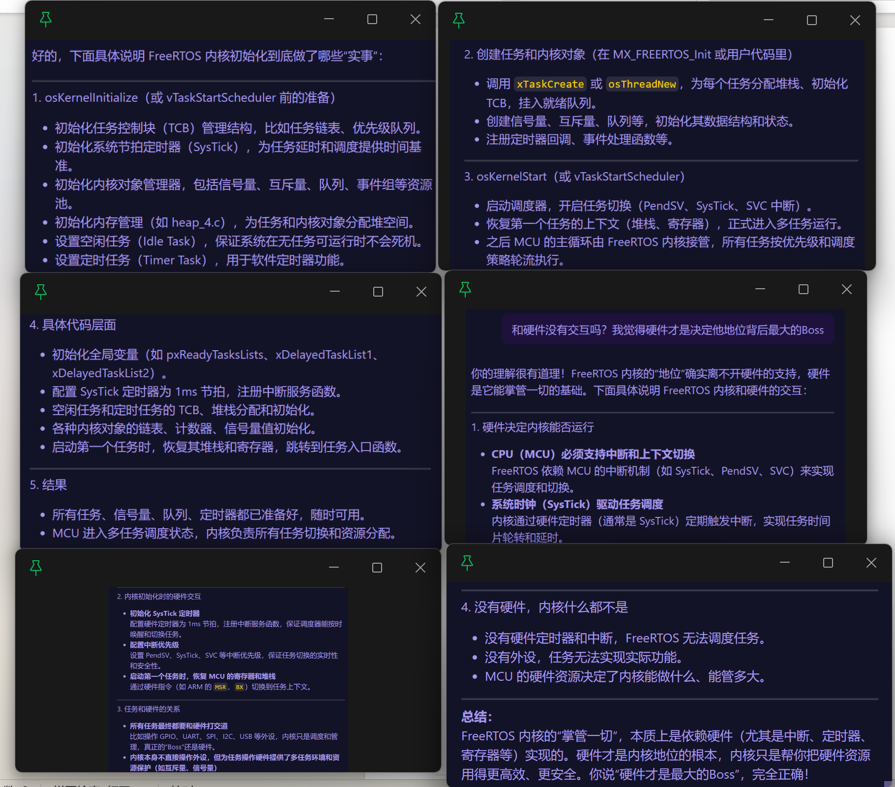

# 今天是9月16号，继续八股文

## 你说说为什么RTOS要在一个任务里面集中创建其他所有的任务，然后在自己销毁自己？

- 设计模式的一种；RTOS领域约定俗成的最佳实践模式，通常被称为“初始化任务模式”，下面说说主要原因：

- 保障任务初始化的“有序性”，避免依赖冲突
  - 嵌入式系统的应用任务往往存在依赖关系，就比如你采用生产者-消费者设计模式，这就很典型的依赖关系嘛，如果在多个地方分散创建（比如在中断，或者其他任务中随机创建）。很容易出现“依赖任务为起点，被依赖任务先运行”的错误逻辑，导致系统错误
  - 通过我们的`启动任务集中创建`的方式，可以严格按照线性顺序规避依赖冲突

- 规避“任务创建阶段的资源竞争”
  - RTOS创建任务时，需要分配两类资源
    - TCB（任务控制块）：存储任务的状态、优先级、栈指针等信息
    - 任务栈：每个任务独立的栈空间，用于保存局部变量、函数调用上下文
  - 如果多个任务同时创建新任务（比如A任务创建B，C任务创建D），这样会出现`全局资源（如TCB链表）的并发访问`---两个任务同时修改TCB链表，可能导致链表损坏（竞态条件），最终会导致任务创建失败或者系统死锁
  - 而如果采用`启动任务是系统启动后唯一运行的任务`，它创建其他任务时，不存在任何`并发资源访问`的场景，无需额外加互斥锁，从根源上避免了资源竞争

- 优化资源利用，避免无用任务长期占用资源
  - 嵌入式系统的资源（RAM、ROM）通常非常有限（比如 MCU的 RAM可能只有几十 KB），启动任务的使命仅在“初始化阶段”，一旦所有应用任务创建完成，它就失去了存在的意义，如果不销毁的话，就会一直占用这个内存，CPU也会定期去光顾它，浪费！

- 简化代码维护，降低调试难度
  - 集中创建任务的模式，会让所有任务的`创建入口`收敛到一个函数（启动任务的任务函数），这种 `中心化`设计有两个显著优势
    - 代码可读性高：看一下启动任务代码，就知道系统有哪些任务了，一目了然
    - 调试效率高：也就是调试任务创建失败这些问题

- 豆书记：<https://www.doubao.com/thread/w4f60eb3bf86b6475>

## 来说说你对内核的理解

- 可以把整个嵌入式系统想象成一个 “工厂”：
  - 工厂里有各种 “设备”（CPU、内存、GPIO、UART 等硬件资源）
  - 有很多 “工人”（应用程序，比如传感器数据处理程序、显示屏控制程序）
  - 而内核就是工厂的 “管理员”，它的核心任务是
    - 协调所有个人（程序）对设备（硬件）的使用，避免冲突
    - 给工人分配资源（像给程序分配内存、CPU运行时间片）
    - 处理紧急情况（像硬件错误、程序崩溃时的异常处理）

- 内核和一般程序的区别：
  - 运行权限不同
  - 职责不同
  - 存在形式不同
- 举个嵌入式的例子：当你在程序中写`printf("hello")`时，这个程序（用户态）不会直接操作 UART 硬件，而是通过调用内核的 “写串口” 系统调用，让内核（特权态）去实际配置 UART 寄存器、发送数据 —— 这就是内核的 “中介” 作用

## 关于内核

- 内核时出厂时烧录的吗？为什么自己没有写过内核代码？
  - 内核的来源“来源”取决于系统的复杂度，分三种情况：
    - 裸机单片机（无内核）：像你的51、STM32裸机程序，根本就没有内核这个概念---你写的代码就是整个系统的全部了，直接操作硬件，这样是不需要内核的，自然就需要我们来写内核的代码了
    - RTOS系统（FreeRTOS等）：内核是一个库，需要我们自己添加到项目中，你拿STM32跑FreeRTOS时候，就需要先下载FreeRTOS的源码，编译到咱们的程序中去---所以这里看出来，内核代码不是出厂自带的，而是根据你的需要进行选装的
    - 复杂系统（Linux等）：这样式的内核通常是 预先烧录 或 者单独烧录 的，像很多的Linux开发板就是先烧录好linux内核，只需要写 .exe程序就好了

- 为什么内核可以管控CPU？它的厉害来自哪里？
  - 因为CPU的硬件设计给了内核“特权”—— 这就像人类社会中，法律本身不能强迫人，但人类设计的 “执法机构”（如警察）让法律有了约束力：来自 CPU的硬件特权设计（特权级、中断机制），不是内核本身有多强，而是硬件给了它 “执法权”
  - 

- 没有内核的裸机单片机，能处理中断吗？
  - 完全可以！中断处理和内核没有必然关系—— 内核的作用是`管理复杂的中断`，而不是`实现中断`
  - 裸机系统处理中断的逻辑很简单：
  - 单片机硬件里有 “中断向量表”（一个固定的内存地址，存放各种中断的处理函数入口）；
  - 你在代码中给特定中断（如定时器中断、GPIO 外部中断）编写 “中断服务程序（ISR）”，并把函数地址放到向量表对应的位置；
  - 当硬件触发中断（比如按键按下），CPU 会自动跳转到向量表中对应的 ISR 地址，执行你的中断处理代码
  - 没有内核时，中断处理完全由你写的 ISR程序直接完成；而有内核时（如RTOS），内核会`包装`一层中断处理：比如在 ISR中只做最紧急的操作（如清除标志），然后通过`信号量/消息队列`通知任务处理---这是为了避免中断占用 CPU太久，影响其他任务，本质是`更规范的管理`，而不是 `中断的前提`

## 我有一个问题，是这样的，在我没有内核程序时，我CPU上电后第一件是是干什么呢？第一个运行的程序是什么呢？我记得是复位Handler函数啊，为什么烧录进内核程序之后，CPU上电的第一个运行的就是内核了？那复位Handler函数不运行了吗？我猜测是在内核程序编写时，有用到类似Bootloader的想法，就是会在程序指定内核代码的位置，这个位置就是在那个重启Handler函数里面，通过这个函数去跳转到我们的内核代码，这样理解也没有问题？

- 首先来明白几个概念：

- CPU 上电后 “第一件事” 永远是固定的：执行复位 Handler函数，无论你有没有内核！
  - 现代 CPU（如 ARM、RISC-V）在硬件层面就规定了：上电复位后，必须从 复位向量`指向的地址`开始执行第一条指令,`复位向量`是一个固定的内存地址（比如Cortex-M的 0x00000004），这个地址里存放的不是指令，而是复位 Handler的入口地址（即复位 Handler函数在内存中的位置）。所以，无论系统有没有内核，CPU上电后第一步必然是：从复位向量取出地址，跳转到复位 Handler函数执行---这是硬件强制的，没有例外

- 没有内核时，复位 Handler 的`接力`终点是`用户的main函数`
  - 在裸机系统（无内核）中，复位Handler 的职责很简单：做最基础的硬件初始化（设置堆栈、初始化时钟、关闭不必要的中断等），然后直接跳转到用户编写的main函数

  ```c
  CPU上电 → 读取复位向量 → 执行复位Handler（汇编编写） → 初始化硬件 → 跳转到main函数（用户的C代码）
  此时，main函数就是整个系统的 “总入口”，所有业务逻辑（如控制 LED、读取传感器）都在main里实现 ---因为没有内核，复位Handler “接力” 给了用户程序
  ```

- 有内核时，复位Handler 的 “接力” 终点是`内核的入口函数`
  - 当系统有内核（如 FreeRTOS、Linux）时，复位Handler的执行流程不变，但 “接力” 的终点变了：它不会直接跳转到用户的main，而是`跳转到内核的初始化函数`

  ```c
  CPU上电 → 读取复位向量 → 执行复位Handler（汇编编写） → 初始化硬件 → 跳转到内核入口（如vTaskStartScheduler）  
  ```

  - 内核入口函数会做什么？
    - 它会完成内核自身的初始化（创建调度器、初始化任务列表、设置定时器中断等），然后再根据用户配置，启动第一个用户任务（这时候才会执行用户编写的任务代码，类似 “用户态” 的main）
- 但是，你这样不经过 main函数直接启动 FreeRTOS内核，很多外设和全局资源都不会被初始化，可能导致：（而且这样不符合大家约定俗成的习惯）
  - 外设（如 GPIO、UART、SPI、USB 等）未配置，相关任务无法正常工作
  - 全局变量、堆栈、时钟等初始化缺失，系统运行异常
  - 任务依赖的硬件和软件环境不完整，导致系统不稳定或不可用

## 中断向量表的作用

- 豆书记有话说：<https://www.doubao.com/thread/w1931fb3102302449>
- 建立 “中断类型” 和 “处理程序地址” 的映射关系
- 让 CPU 在中断发生时能快速找到并执行对应的处理代码
- 其位置和格式由硬件规定，是 “软件中断处理” 和 “硬件中断信号” 之间的桥梁
- 没有中断向量表，CPU 就无法识别 “哪个中断该由哪个程序处理”，整个系统的实时响应能力也就无从谈起 —— 这也是为什么任何带中断的系统（从简单单片机到复杂 Linux）都必须有中断向量表
