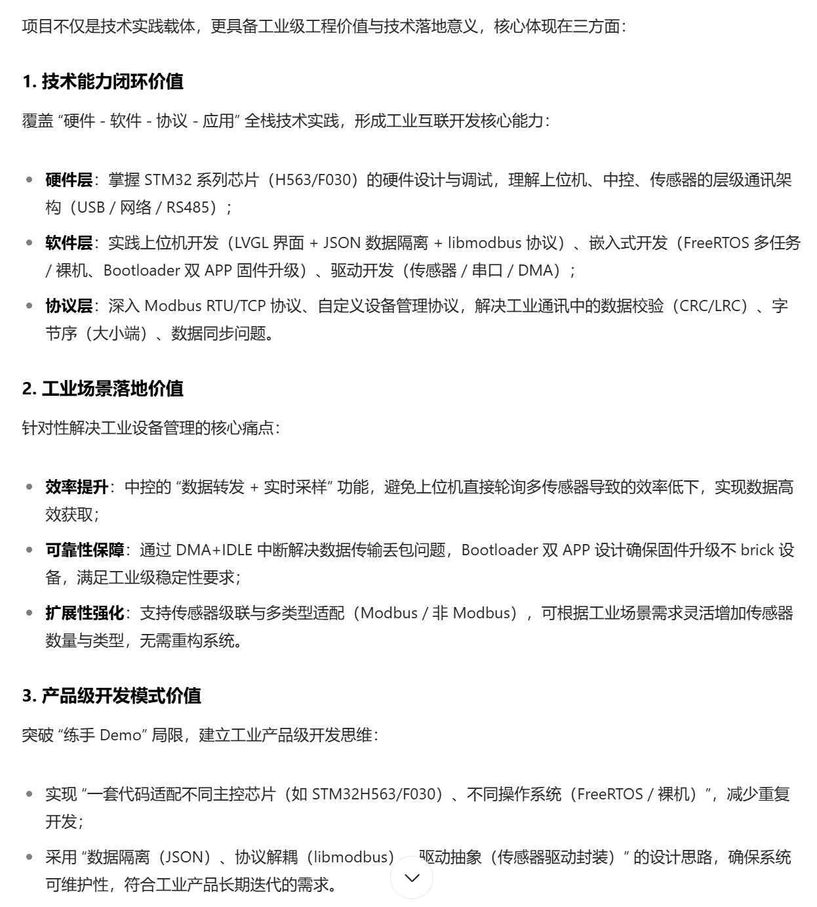

# 汇顶一面准备

## 项目背景、意义、应用市场

- 项目背景：针对工业场景中 “设备分散、通信不稳定、维护成本高” 痛点，开发简化版全场景工业互联系统，核心目标是解决工业环境下 “多传感器高效管理”
- 项目意义：
  - 技术能力闭环（硬件、软件、协议、应用）
  - 工业场景适配（效率、可靠性、扩展性）
  - 产品级别开发（一套代码适配不同主控芯片 STM32H563/F030、数据隔离、抽象封装）
- 应用市场：工业自动化、智能制造等领域，技术具有通用型，可以迁移到消费电子等

## 项目的硬件方案、软件方案

- 硬件方案：
  - 上位机：GUI显示、方便操作
  - 中控：数据转发、提高数据处理效率
  - 传感器：数据采集上报（用到了开关量、环境监测、温湿度，后续可以增加控制逻辑）
- 软件方案：
  - 上位机：lvgl开发；数据传输基于libmodbus，可以使用Modbus RTU/TCP协议；自定义协议，以实现：设备ID写入（PointMap）、设备状态检测、数据读写、程序升级等功能❓
  - 中控：主要基于FreeRTOS+HAL库，分为BootLoader和Application两个部分❓
  - 传感器：主要基于FreeRTOS+HAL库，分为BootLoader和Application两个部分❓

## 项目使用的硬件设备

- 屏幕：ST7796U2 TFT-LCD 控制器（分辨率 320×480 18位色深 使用SPI） + BOE 3.52寸
- 触控：FT6336U 电容式触控控制器 使用SPI/IIC
- 主控/传感器：

## 熟悉项目用到的总线协议

- IIC、SPI、UART
- RS232/485电平
- TTL电平和CMOS电平

## 你是怎么移植libmodbus库和USBx2.0协议栈的？

- 先分析二者的差异：（使用层面/完整性/···）
  - USBx：
  - libmodbus：

## 如何在RTOS下使用UART？

- 或者说在RTOS下使用这些协议传输数据，是怎么确保数据完整传输呢？会不会因为任务切换而导致数据丢失呢？❓❓
