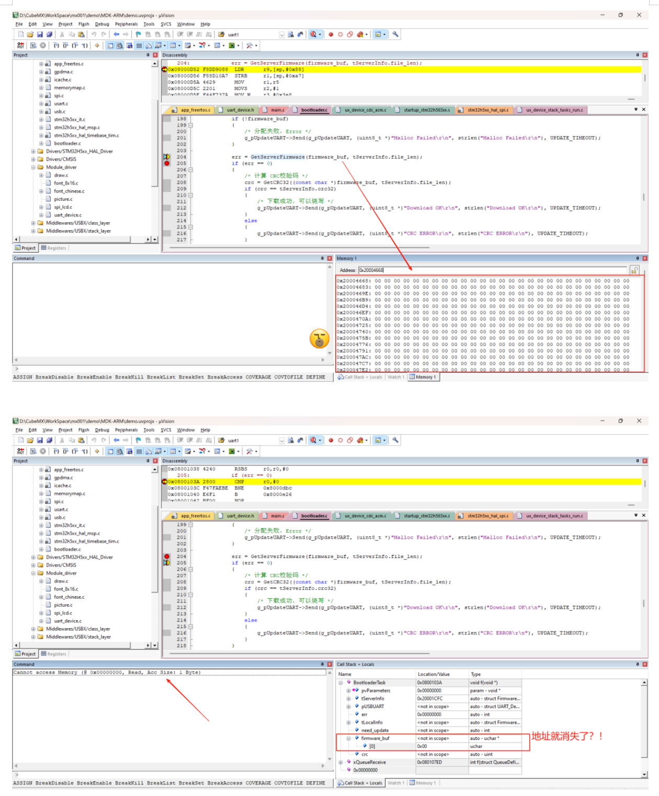
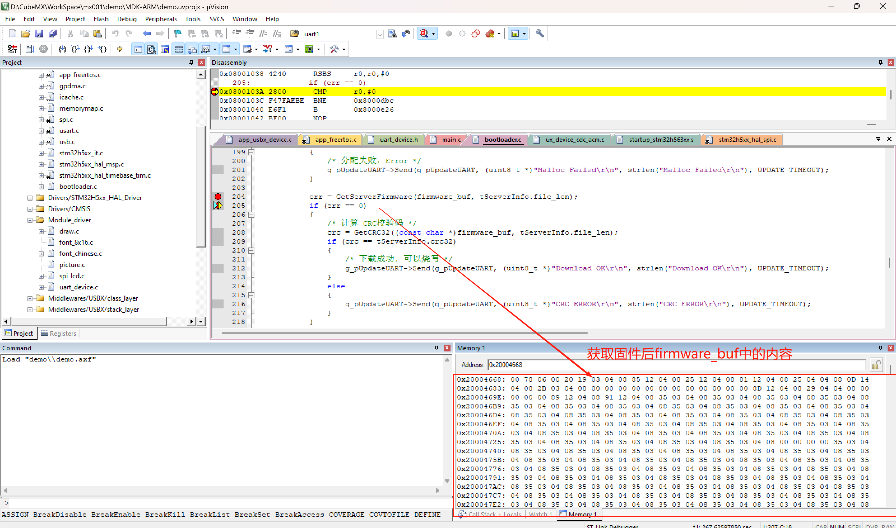
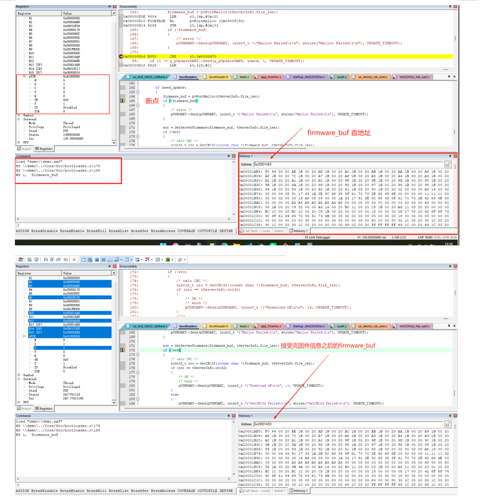

# 下载协议

1，要实现下载流程，就行确定上位机和下位机之间的通信协议，根据Bootloader来设计该传输协议

- 下位机发送请求给上位机，请求获取升级信息

- 上位机发送固件信息给下位机，上位机发送的固件信息里含有：
  - 数据流大小、长度
  - App加载地址
  - 校验码
  - 其他：配置信息Cfg，文件名......
- 下位机在收到数据后，需要进行校验，校验通过后，将数据写入到指定地址
- 上位机先发同步字符，再发一个“结构体”

- 下位机根据上位机发送的结构体，来决定是否升级
  - 由Bootloader决定
  - 若决定升级，则发送“确认”字符
  - 上位机将文件发给Bootloader
  - Bootloader计算CRC，和之前收到的固件信息比对

- Bootloader烧写

## 代码框架

1，定义固件信息结构体

```c
typedef struct FirmwareInfo {
    uint32_t version;
    uint32_t file_len;
    uint32_t load_addr;
    uint32_t crc32;
    uint8_t file_name[16];
} FirmwareInfo, *pFirmwareInfo;
```

2，代码框架

- 本地查询
- emmm

## 大小端字节序转换

1，u32数据类型的大小端转换：

```c
static uint32_t BE32toLE32(uint8_t *buf)
{
    return ((uint32_t)buf[0] << 24) | ((uint32_t)buf[1] << 16) | ((uint32_t)buf[2] << 8) | ((uint32_t)buf[3] << 0);
}
```

## 问题

1，队列长度不够，导致下载失败：

- 这个问题也排查了很久，最后发现是 PC发送的文件大小远远超出了队列的大小，导致数据的覆盖、丢失
- 最后计算出的CRC32校验码就不对

2，函数传入的参数错误：野指针问题

- 直接看代码：

```c
// 任务函数 BootloaderTask
void BootloaderTask(void *pvParameters)
{
    UART_Device *pUSBUART = GetUARTDevice("usb");
    pFirmwareInfo tLocalInfo;  // 本地信息
    pFirmwareInfo tServerInfo; // 服务器信息

    // 省略中间代码

    err = GetLocalFirmwareInfo(tLocalInfo);

    Draw_String(0, 16, "Next Statge", 0x000000ff, 0x00000000);        // 打印判断程序能否进来
    if (err == 1)
        /* 进行下一步操作 */
    else
        /* 本地没有应用程序，进入升级模式 */

    Draw_String(0, 32, "Next Statge", 0x000000ff, 0x00000000);        // 打印判断程序能否进来
    /* 查询服务器端 */
    while (1)
    {
        /* 获取服务器固件信息 */
        err = GetServerFirmwareInfo(tServerInfo);
        // 省略剩下代码
    }
}

// 被调用函数 GetLocalFirmwareInfo
static int GetLocalFirmwareInfo(pFirmwareInfo l_FirmwareInfo) // 获取本地固件信息
{
    /* 获取Flash中的固件信息 */
    pFirmwareInfo ptFlashCfgInfo = (pFirmwareInfo)CFG_OFFSET;
    /* 判断是否含有有效的配置信息 */
    if (ptFlashCfgInfo->file_len == 0xFFFFFFFF)
    {
        Draw_String(0, 80, "No Cfg", 0x0000ff00, 0x00000000);
        // return -1;                                        // 去掉 return，观察程序卡死在这的情况
    }
    
    *l_FirmwareInfo = *ptFlashCfgInfo;                       // 程序在这里死掉了，因为传入的指针变量 tLocalInfo，没有进行初始化，这恰好触发了 HardFault
    return 1;       
}

// 类似的函数 GetServerFirmwareInfo亦是如此

- 正确的操作是要传入参数：
    FirmwareInfo tLocalInfo;  // 本地信息
    FirmwareInfo tServerInfo; // 服务器信息
 的地址：&tLocalInfo, &tServerInfo

```

- 这样的小错误不易发现，但是很致命，希望下次好好注意
- FirmwareInfo *localInfo;和FirmwareInfo localInfo;有什么区别嘛？​<https://www.doubao.com/thread/wa19b6382c977374c>

3，一个for循环引发的错误

- 减少了一次for循环，最终引发了 HardFault😡🤬
  - 但是再次复现，却不能进入😫
- 二者的图片示例对比如下：
- 
- 
- 

- 但是，最后我还是觉得应该只是CRC校验码的错误
- 至于HardFault的错误，应该是在调试时多次下载文件到内存，但是却没有清除之前的，最终导致内存不够
- 所以说，打印错误、调试信息很重要，可以帮助我们快速定位！！！😭😭😭
