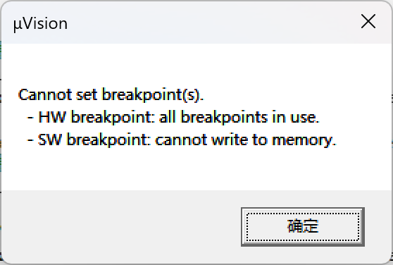

# Write File Record功能

1，设想场景如下：

上位机需要发文件给modbus传感器，可能发送1个或者多个文件....
那么，对于modbus传感器

- 需要知道是哪一个文件
- 文件可能很大，要知道发送的modbus数据包一次最多256字节，出去包头、校验码这些，能传输的数据更少
  - 由此，必然会将大文件拆分成若干个 块 来发送
  - 这里称为 Record，分解为多个Record来发送
  - 传输的数据包里面一定会包含这个文件里的哪一个 块？（Record）
  - ADU：应用数据包                   PDU：Protocol Data Unit，协议数据单元
- Record 的个数
- 数据本身

## Write File Record功能的数据包格式

1，数据包格式

- 设备地址：1个字节
- 功能码：1个字节表示，0x15
- 数据长度：1个字节表示，范围0x09 ~ 0xFB   == （1+2+2+2 + 2N）
  - 这个范围，小有讲究🤓
  - 数据长度  最大244字节，最小2字节（251 - 7 = 244，9 - 7 = 2）

- 引用类型：1个字节表示，0x06（固定）
- File Number：2个字节表示，并不关心文件的名字，文件的number才是需要关心的 （编号），范围0x0001 ~ 0xFFFF
- Record Number：2个字节表示，我这大文件需要拆成多个小块来发送，这个意思就是指明了现在传输的是哪一个，范围0x0000 ~ 0x270F
- Record Length：2个字节表示数据长度大小 N

- Record Data：就是上一条说的 N个数据，每个数据大小 2个字节，总共 2N 个字节
  - 如果要传输 200个字节的数据
  - 那么需要的buf大小为 212字节大小（3 + 7 + 2）
- 校验码CRC：2个字节

3，上位机的回应：原样的数据，非常的简单粗暴啊😱😱😱

```c
case MODBUS_FC_WRITE_FILE_RECORD: {
    memcpy(rsp, req, req_length);        // 直接cpy过去
    rsp_length = req_length;
} break;
```

4，这个功能只是去发送文件的某一小块，并没有实现整个文件的传输的功能

- 那么问题来了，如果一个块只有一个字节怎么办？如何分辨？
- 如何实现写文件的功能？
  - 把一个文件拆分成诺干

5，在 _modbus_receive_msg函数中，添加了两个关键函数

- compute_meta_length_after_function
- compute_data_length_after_meta

## 代码框架：函数Write_File_Record()的分析

- 详情见韦东山老师的讲解视频
- 重点核心在于主从机的发送、接收、响应、验证，这几个阶段

## 使用Write File Record功能实现文件传输

1，特殊的“Record”

- 它的record_no等于零
- 旨在引导后续的数据接收
- 其中包含：
  - 文件的长度
  - ......
- C代码实现

```c
int modbus_write_file(modbus_t *ctx, uint16_t file_no, char *file_name, uint8_t *buffer, uint16_t len)
{
    FileInfo tFileInfo;
    int rc;
    int record_no = 0;
    uint16_t pos = 0;          // 记录文件record 的发送位置
    uint16_t per_send_len = 0; // 每次烧写的字节数

    memset(&tFileInfo, 0, sizeof(FileInfo));
    tFileInfo.file_len = len;
    tFileInfo.file_len = LE32toBE32(&(tFileInfo.file_len));
    if (file_name)
    {
        strncpy(tFileInfo.file_name, file_name, sizeof(tFileInfo.file_name));
    }

    rc = modbus_write_file_record(ctx, file_no, record_no, (uint8_t *)&tFileInfo, sizeof(tFileInfo)); // 发送文件的头部
    if (rc < 0)
    {
        Draw_Clear(0);
        Draw_String(0, 0, "Write File Header Record Failed!", 0xff0000, 0);
        return rc;
    }
    record_no++; // 更新下一个要写的文件块

    while (pos < len) // For循坏将数据一小块一小块的发送出去
    {
        per_send_len = len - pos;
        if (per_send_len > 240)
        {
            per_send_len = 240; // 每次发送240字节，烧录一次是16字节，选取240 = 15*16 字节是为了便于烧录
        }
        rc = modbus_write_file_record(ctx, file_no, record_no, buffer + pos, per_send_len); // 发送文件剩余部分，一次最多发送 244字节
        if (rc < 0)
        {
            Draw_Clear(0);
            Draw_String(0, 0, "Write File Record Failed!", 0xff0000, 0);
            return rc; // 出错结束
        }
        record_no++;
        pos += per_send_len; // 更新下次写位置
    }

    return 1;
}
```

2，接收端的解析

```c
static void modbus_parse_file_record(uint8_t *msg, uint16_t msg_length)
{
    uint16_t record_no;
    FileInfo tFileInfo;
    char buf[100];
    static int recv_len = 0;

    /* 根据msg的内容，结合write_file_record的消息格式，来打印一些信息 */
    if (msg[1] = MODBUS_FC_WRITE_FILE_RECORD)
    {
        record_no = ((uint16_t)msg[6] << 8) | (msg[7] << 0);
        if (record_no == 0)        // 收到了文件的头部
        {
            tFileInfo = *((pFileInfo)&msg[10]);
            FileInfo.file_len = BE32toLE32(&(tFileInfo.file_len));
            sprintf(buf, "Get File Record for Head, File len = %d", tFileInfo.file_len);
            Draw_String(0, 48, buf, 0xff0000, 0);        // 成功收到file_record头部
            recv_len = 0;
        }
        else        // 收到数据本身
        {
            recv_len += (msg[2] - 7);
            sprintf(buf, "Get File Record %d for Data, record_len = %d, recv_len = %d", record_no, msg[2] - 7, recv_len);
            Draw_String(0, 64, buf, 0xff0000, 0);        // 成功收到file_record数据
        }
    }
}
```

## 碰到的问题

1，忘记注解掉 draw.c 文件里面的部分代码，致使 LCD无法正确绘制、显示：

```c
static void Draw_Region(uint32_t x, uint32_t y, P_BitMap ptBitMap)
{
#ifdef MULTI_DEVs_ACCESS
    /* 多设备访问的保护机制：获取 Mutex */
    xSemaphoreTake(g_spi_lcd_lock, portMAX_DELAY);
    LCD_SetWindows(x, y, x + ptBitMap->width - 1, y + ptBitMap->height - 1);
    LCD_SetDataLine();
    LCD_WriteDatas(ptBitMap->datas, ptBitMap->height * ptBitMap->width * 2);
    /* 多设备访问的保护机制：释放 Mutex */
    xSemaphoreGive(g_spi_lcd_lock);
#endif
    // /* 设置要显示的区域 */
    // LCD_SetWindows(x, y, x + ptBitMap->width - 1, y + ptBitMap->height - 1);

    // /* 设置D/C引脚表示后面要发送数据 */
    // LCD_SetDataLine();
    
    // /* 发送数据 */
    // LCD_WriteDatas(ptBitMap->datas, ptBitMap->height * ptBitMap->width * 2);
}

本来后面一片（#endif后面）都是要注释掉的
```

- 虽然说把后面的注释掉就正常了，但是
- 我无法在这个函数里面设置断点......
- 是函数调用深度的问题吗？
- 设置breakpoint时有如下提示：
- 
- <https://www.doubao.com/thread/wf6d67b695be6e712>

2，从机响应错误，check_confirmation函数的返回值不正确

- 原因是条件分支语句缺少了处理该功能码的分支

3，接收buf的大小设置不当

4，为什么传输更多数据时，需要一倍以上的Rx_buf，才可以实现数据的正确传输？

- 这个问题的关键是忽视了DMA+UART传输过程中的 传输过半中断
  - 当数据传输为总数据量大小的一半时，会触发事件中断（Event），执行事件回调函数
  - 基于上述，如果Rx_buf不满足一倍以上的数据量大小，那么数据没有全部传输完成时，会被打断，且根据前面的代码会重新开启传输，这回导致从机数据接收不正常
  - 基于此，我们也可以更加合理的去设置等待从机响应超时时间、字节间超时时间

  ```c
    #define _RESPONSE_TIMEOUT 500000        // 从机响应的超时时间，单位ms
    #define _BYTE_TIMEOUT     20000         // 一次数据的传输满足 “115200， 8， N， 1， 0”的格式，可以计算最小等待时间：10/115200 * 128 == 11ms
                                            // 前一半数据传输完成，读取一次，后一半完成再读取一次，前后字节间最小等待时间
  ```

- 修改HT回调函数如下：

```c
void HAL_UARTEx_RxEventCallback(UART_HandleTypeDef *huart, uint16_t Size)
{
    pUART_Data pData;
    if (huart == &huart2)
        pData = &g_uart2_data;
    if (huart == &huart4)
        pData = &g_uart4_data;

    static uint16_t old_pos = 0;

    /* 写队列，把 g_uart4_rx_buf size bytes写入到 queue */
    for (int i = old_pos; i < Size; i++)
    {
        xQueueSendFromISR(pData->Rx_Queue, (const void *)&pData->Rx_BUF[i], NULL);
    }
    
    old_pos = Size;
    if (huart->RxEventType != HAL_UART_RXEVENT_HT)
    {
        old_pos = 0;
        /* 重新启动 DMA + IDLE 接收 */
        HAL_UARTEx_ReceiveToIdle_DMA(pData->huart, pData->Rx_BUF, UART_RX_BUF_LEN);
    }
}
```
