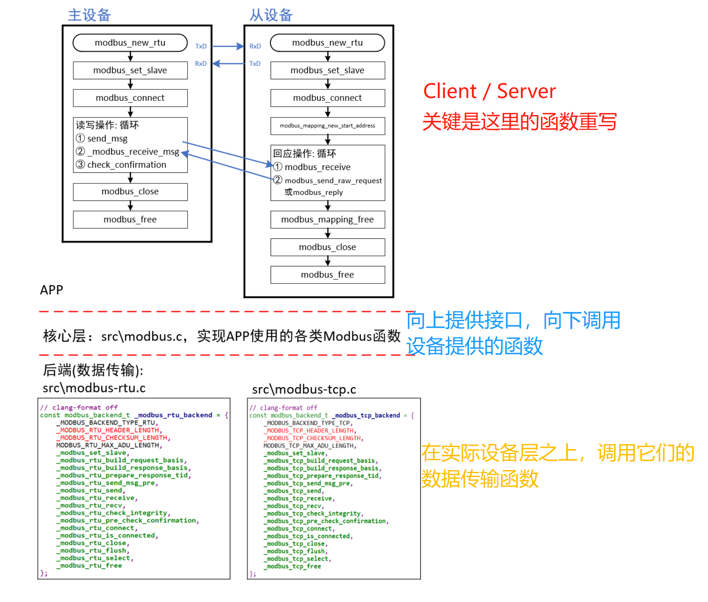

# 移植libmodbus

1，移植libmodbus的源码到`stm32h5`单片机上

- 原生的libmodbus只支持`Win`和`Linux`系统
- 移植的关键是要自己去实现`libmodbus`的`backend`，即后端

## libmodbus的层次结构

- 

- 应用层：向上层业务提供`统一的Modbus操作接口`（读写coils，registers）
- 核心层：负责`协议核心逻辑`、`数据解析`、`状态机管理`等，并通过`modbus_backend_t`定义的结构体函数表调用后端的IO操作
- 后端层：实现实际的`物理/网络传输细节`
  - 设备层：是使用的usb？uart？tcp？
- 调用过程示例：

```c
appfreertos.c
static void CH2_UART4_ServerTask(void *pvParameters)
{
    /* 参考libmodbus的server_test源码 */
    modbus_t *ctx;
    uint8_t *query;
    int rc;
    modbus_mapping_t *mb_mapping;
    uint8_t UT_INPUT_BITS_TAB[] = {0};  // 数组名的本质是常量指针

    ctx = modbus_new_st_rtu("uart4", 115200, 'N', 8, 1);  // 首先创建一个modbus结构体
    modbus_set_slave(ctx, 1);
    省略后续代码...
}

其中 modbus_set_slave(ctx, 1); 的实现：

modbus.c
int modbus_set_slave(modbus_t *ctx, int slave)      /* Define the slave number */
{
    if (ctx == NULL) {
        errno = EINVAL;
        return -1;
    }

    return ctx->backend->set_slave(ctx, slave);
}
可以看出最后是由backend的set_slave函数实现的，
而backend是在modbus_new_st_rtu函数中根据设备类型创建的，所以最终是由uart4的set_slave函数实现的

modbus_st_rtu.c                         // 这里我们改了名字，原来是 modbus_rtu.c
static int _modbus_set_slave(modbus_t *ctx, int slave)      // 在主模式下定义要通信的远程设备的从机 ID，或者在从模式下设置内部从机 ID。
{
    int max_slave = (ctx->quirks & MODBUS_QUIRK_MAX_SLAVE) ? 255 : 247;

    /* Broadcast address is 0 (MODBUS_BROADCAST_ADDRESS) */
    if (slave >= 0 && slave <= max_slave)
    {
        ctx->slave = slave;
    }
    else
    {
        errno = EINVAL;
        return -1;
    }

    return 0;
}

最后会调用对应设备的、操作硬件的函数去实现，set_slave没有体现哈（也不需要吧，来看发送函数的

uart.c
static ssize_t _modbus_rtu_send(modbus_t *ctx, const uint8_t *req, int req_length)
{
    /* 使用UART2/UART4的UART_Device来发送数据 */
    modbus_rtu_t *ctx_rtu = ctx->backend_data; // 根据backend的参数
    UART_Device *pdev = ctx_rtu->dev;

    /* 发送数据 */
    if (pdev->Send(pdev, (uint8_t *)req, req_length, TIMEOUT_SEND_MSG) == 0) // 自动选择使用uart2或者uart4的代码来发送数据
        return req_length;
    else
    {
        errno = EIO;
        return -1;
    }
}
```

## 移植中碰到的问题

1，在进行 PC为主设备、h5开发板为从设备的实验中：从机收不到PC发来的数据

- 最后一顿排查，发现原来是，在`rtos`中写队列时，错误的传入了参数`pvItemValue`（名字记不大清了）
- 同样的问题还出现在最后用两路`RS485`实现`Modbus`通信时，在`modbus_write_registers`也是传入的参数不对，导致程序卡死

2，在选用后端设备为`usb`时，出现了PC无法识别到usb设备的情况：

- 最后一顿排查，发现是，将`usb_client`的任务优先级设置的太高了，导致默认任务里创建usb设备的任务得不到执行，程序亦卡死

## 移植过程中注意的点

1，注意避免重复创建

```c
if (!g_xUSBUART_Send)
{
    g_xUSBUART_Send = xSemaphoreCreateBinary();
    g_xUSBUART_RX_Queue = xQueueCreate(200, 1);
}
```

2，注意 读/写 保护

```c
int ux_device_cdc_acm_getchar(uint8_t *data, uint32_t timeout)
{
    if (g_xUSBUART_RX_Queue)
    {
        if (pdPASS == xQueueReceive(g_xUSBUART_RX_Queue, data, timeout))
            return 0;
        else
            return -1;
    }
    else
    {
        return -1;
    }
}
```
