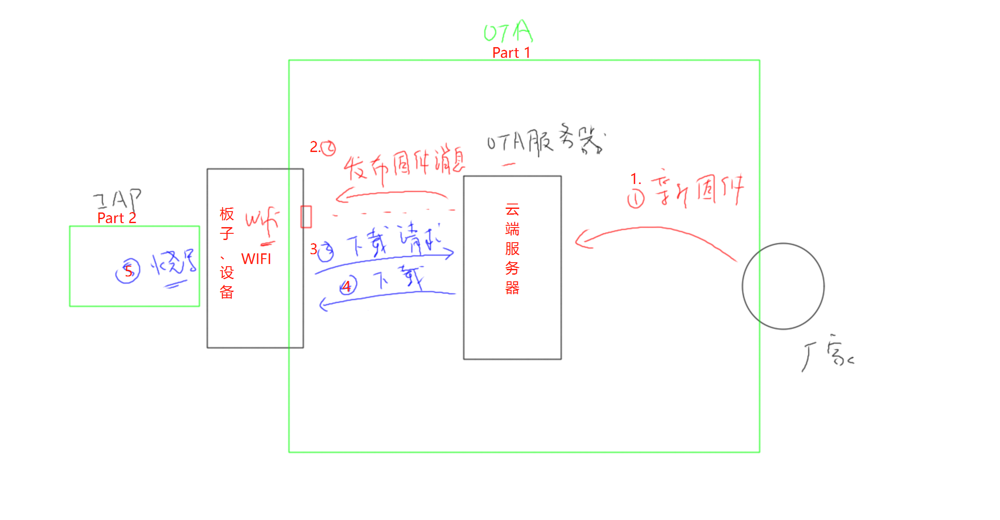
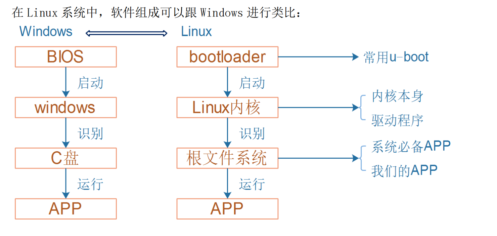

# OTA和IAP

1，OTA：Over-The-Air，仅仅只是下载而已，空中下载文件，让我们的板子可以通过网络隔空下载到文件

- 如果下载的文件是，是要更新的固件，那这个就叫IAP

2，IAP：In-Application Programming，在应用程序中编程，是指在应用程序中实现升级功能，不需要重新烧录程序，只需要在应用程序中下载新的程序，就可以实现升级功能

- IAP是OTA的一种应用场景

3，OTA实现程序升级：

- 最后的烧写，可能是全部下载到内存在进行烧写，也可能是边下载边烧写

## 本地下载

1，通过USB串口或者其他串口，与PC相连，将文件下载到板子上

- PC端可以使用简单的串口工具，就可以发送要下载的固件程序、数据等
- 设备端需要实现代码：重点：设备要怎么做，才可以更新自己呢？
- 要实现自我升级，就要引入Bootloader

## Bootloader

1，在单片机中，RAM一般都比较小，Flash相关而言算大了

- 在Flash中，存有我们的App，和配置信息Cfg
- 上电时，CPU从Flash里面执行代码，从Flash中读取指令执行，那么这个App能不能够下载代码放入内存RAM，然后来烧写自己呢？
  - 谁下载，谁烧写：下载到哪？烧写到哪？
  - Flash中决定下载到内存RAM，再烧写到Flash中
  - 将Flash分为两块区域，其中负责下载和烧写的部分，称之为`Bootloader`
  - 这样也可以避免程序烧写自己本身
  - 烧写完成会设置标志位，决定下次启动时要不要进行固件程序的更新
- 所以，对于单片机想要实现程序升级的话，需要引入Bootloader

2，设备的内存较大时，现在的技术发展，大内存以及不再是问题了

- 可以将Flash中的App复制拷贝到内存中去，后面运行的就都是内存中的App，这个App当然就可以进行下载和烧写了
  - 不会有烧写自己的风险
  - 但是，一旦断电板子就变砖
- 所以，即使大内存也会保留Bootloader，用于下载和烧写App，以及恢复App

3，Bootloader的功能

- 
- 初始化硬件：比如设置时钟、初始化内存
- 启动内核：从 Flash 读出内核、存入内存、给内核设置参数、启动内核
- 调试作用：在开发产品时需要经常调试内核，使用 BootLoader 可以方便地更新内核

- 其实说白了就两个：启动后面的应用程序，升级后面的应用程序

## ARM架构--芯片上电后

1，Flash最开始保存的是App：（即0地址）

2，Flash最开始保存的是Bootloader：

- Bootloader要去模仿硬件的操作，去启动App：
  - xxx设置SP，xxx存入PC寄存器
  - 把异常向量表的地址告诉CPU
    - 设置Vector寄存器为新的异常向量表（指向新的位置）
    - 读取该位置上，第一个4字节数据存入SP，
    - 读取该位置上，第二个4字节数据存入PC，并跳转到PC指向的地址执行
  - 告诉应用程序App的地址在哪里

## Bootloader与App

1，Bootloader和应用程序有各自的异常向量表

- Boot程序去启动具体的App：<https://www.doubao.com/thread/w3ba34986dc021afb>
  - 关键启动过程：
  - Bootloader代码    ---→   App的Reset Handler     ---→   App的具体逻辑（如 main 函数）
  - 代码示例：

```asm
                AREA    |.text|, CODE, READONLY

; Reset Handler
jump.s文件：
start_application   PROC
                EXPORT  start_application             [WEAK]
                ; Set Vector, R0(0x08040000) ---> VTOR
                LDR R1, =0xE000ED08     ; 把地址0xE000ED08存入 R1寄存器
                STR R0, [R1]            ; 把 R0寄存器的值：新异常向量表的位置，存入 R1所指的地址：0xE000ED08
                                        ; 此时，VTOR寄存器（地址0xE000ED08）存的就是 新异常向量表的基地址
                ; Read & Set SP
                LDR R1, [R0]            ; 从 R0寄存器所指向的内存地址中，读取数据，然后将该数据写入 R1寄存器中，这时 R1寄存器的值被修改，[R1]不再指向地址：0xE000ED08
                MOV SP, R1              ; 将 R1的值存入 SP寄存器

                ; Read & Jump
                LDR R1, [R0, #4]        ;  从 R0寄存器所指向的 内存地址偏移4字节 的地址中，读取数据，然后将该数据写入 R1寄存器中
                BX R1                   ; 跳转到 R1执行，此时 R1的值是 Reset_Handler的地址值

                ENDP        ; 结束过程（Procedure）
                END         ; 整个汇编程序结束

- 上述的，说明应用程序的向量表被放置在 0x08040000 这个地址，事实也确实如此
- 代码LDR R1, [R0]    :     这正是访问应用程序向量表的第 0 个条目（偏移 0x00），该条目存储的是应用程序运行所需的初始栈顶地址
- 按照 ARM 向量表规范，程序启动时必须先从向量表第 0 个条目获取栈地址，否则无法正常分配栈空间
```

- 代码解析：<https://www.doubao.com/thread/w87193e8b9871a79b>
- 在Bootloader的mian.c文件中，传入的参数被写入到 R0寄存器中

```c
main.c文件：
extern void start_application(unsigned int vector);
start_application((unsigned int)0x08040000);
```

- Bootloader和应用程序的异常向量表：<https://www.doubao.com/thread/w492e2d47a51f49dd>

2，Bootloader和应用成语程序只能有一个使用ICACHE，两个都使用的话会死机

## STM32启动过程浅析

- <https://www.doubao.com/thread/we0fa828ea1330c5b>

## ARM架构的规则

1，芯片上电后从0地址开始执行：[ARM 架构对 “启动地址” 的规范：提供框架而非强制固定]

- 架构规范中，复位后处理器会首先读取向量表的前两个条目（栈顶指针和复位处理程序地址）
  - 但架构同时支持通过VTOR 寄存器（向量表偏移寄存器）修改向量表基地址，允许芯片厂商或用户在启动后切换到其他地址（如应用程序的向量表）
- 芯片厂商的决定权：0 地址的实际映射由厂商设计
  - 情况 1：0 地址映射到 Boot ROM
  - 情况 2：0 地址映射到片内 Flash
  - 情况 3：0 地址映射到 RAM（罕见）
- “从 0 地址启动” 的本质：是 “逻辑地址” 而非 “物理地址”,需要注意的是，这里的 “0 地址” 通常是逻辑地址（处理器视角的地址），而非物理硅片上的存储位置
  - 通过芯片的内存映射（Memory Map） 机制，厂商可将逻辑 0 地址映射到任意物理存储
  - 例如：芯片的物理 Flash 起始地址可能是 0x08000000，但厂商通过内存映射，将逻辑 0 地址 “别名映射” 到 0x08000000，使得处理器访问 0 地址时实际操作的是 Flash

2，VTOR寄存器的地址

- 在 ARM Cortex-M 架构中，VTOR 寄存器的物理地址是固定的，这是由 ARM 架构规范统一定义的，芯片厂商无法修改，目的是保证软件的兼容性
- VTOR（Vector Table Offset Register，向量表偏移寄存器）的`核心作用`就是存储当前正在使用的异常向量表的基地址
  - “修改 VTOR 的值” 本质上就是告诉处理器：“从现在开始，使用新的基地址对应的向量表来响应异常”
  - 具体作用体现在：
  - 适应不同程序的异常处理需求：例如 Bootloader→应用程序 或 不同场景（如 Flash→RAM）的异常处理需求

3，对于ARM和芯片厂商之间的理解：<https://www.doubao.com/thread/wf6ef0926d4b376b9>
